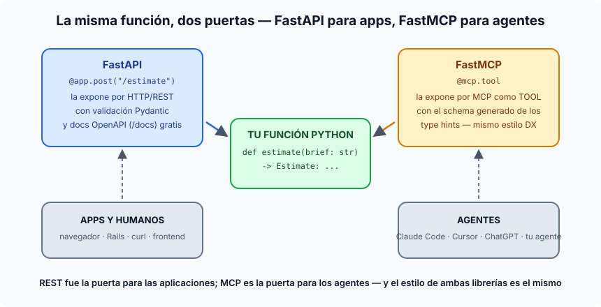

# FastAPI y FastMCP — la puerta para apps y la puerta para agentes

## Qué es FastAPI

FastAPI es el framework moderno de Python para construir **APIs HTTP/REST**
(open source, MIT; lo creó Sebastián Ramírez "tiangolo" en 2018 y hoy es EL
estándar de facto para servicios de IA). Su truco fundacional: aprovecha los
**type hints** de Python — anotas tu función con modelos Pydantic y de ahí
salen *gratis* la validación de entrada (el 422 automático), la serialización
de salida y la **documentación OpenAPI autogenerada** (el `/docs` interactivo
que usamos todo el curso). Es asíncrono de nacimiento (corre sobre uvicorn) y
su estilo son decoradores sobre funciones normales:

```python
@app.post("/api/v1/estimate")
async def estimate(request: EstimationRequest) -> EstimationResponse: ...
```

Nuestro `ai-service/` entero es FastAPI — cada router de `app/api/` es
exactamente ese patrón, y el contrato CI del curso se valida contra el OpenAPI
que FastAPI genera solo de los modelos Pydantic.

## Qué es FastMCP

FastMCP es a los **servidores MCP** lo que FastAPI a las APIs REST — y el
nombre es un homenaje deliberado. Contexto mínimo: **MCP** (Model Context
Protocol, Anthropic 2024, hoy estándar abierto adoptado por todo el sector) es
el protocolo con el que un **agente** descubre y llama herramientas externas —
"el USB-C de las tools": expones una vez, y cualquier cliente MCP (Claude
Code, Cursor, ChatGPT...) puede usarlas. FastMCP (creado por Jeremiah Lowin;
su núcleo 1.0 fue absorbido por el SDK oficial de MCP en Python, y FastMCP 2.x
sigue como el framework completo) te deja montar uno con la misma ergonomía:

```python
mcp = FastMCP("estimator")

@mcp.tool
def estimate(brief: str) -> Estimate:
    """Estimate a software project from a brief."""
    ...
```

Del type hint y el docstring sale el **JSON Schema de la tool** — la misma
magia de FastAPI, apuntando a otro consumidor.

## La simetría (la idea que hay que llevarse)



La misma función de negocio puede tener **dos puertas**: FastAPI la expone a
*aplicaciones y humanos* (HTTP + OpenAPI); FastMCP la expone a *agentes* (MCP
+ tool schemas). REST fue la interfaz universal de la era de las apps; MCP
está siendo la interfaz universal de la era de los agentes. Y la pareja se
lleva tan bien que FastMCP puede **generar un servidor MCP a partir de una app
FastAPI existente** (`FastMCP.from_fastapi(...)`) — tus endpoints, convertidos
en tools.

## Dónde encaja en el curso

- FastAPI: en todas partes — el `ai-service` es el proyecto vertebral del
  máster (S2 lo scaffoldea, S15 lo despliega).
- FastMCP/MCP: **el proyecto deliberadamente NO tiene servidor MCP** — sus
  agentes son internos y la única puerta es REST con `X-Service-Token`. Es la
  extensión natural si algún día quisiéramos que agentes externos (un Claude
  Code, un Cursor) usaran el estimador como herramienta: una capa FastMCP
  fina envolviendo los endpoints existentes. Buen ejercicio mental para
  cerrar la S12: ¿qué tools expondrías, y con qué límites?
