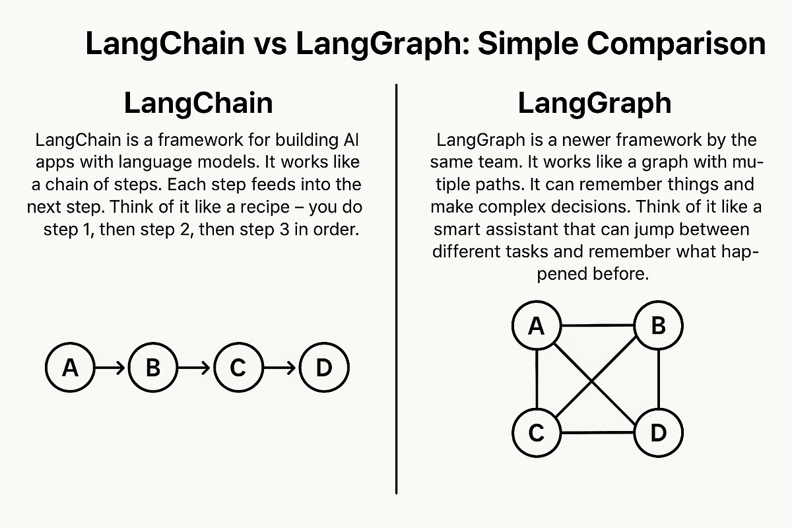
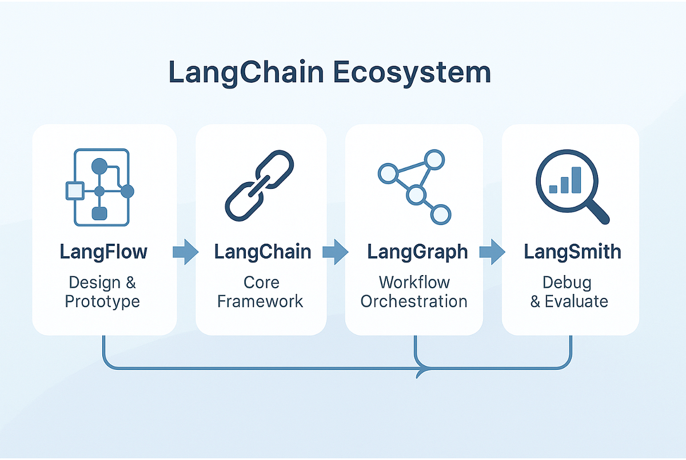

# LangChain y LangGraph — qué es cada uno y cómo se relacionan

## Qué es LangChain

LangChain es el **framework generalista para construir aplicaciones con LLMs**
más conocido del ecosistema (open source, MIT; lo creó Harrison Chase en 2022
y hoy lo mantiene la empresa LangChain Inc.). Su propuesta: piezas
estandarizadas y componibles para todo lo que rodea a un LLM — clientes de
modelos intercambiables, plantillas de prompts, parsers de salida, loaders de
documentos, splitters de texto, retrievers, memoria conversacional — que se
encadenan unas con otras (de ahí el nombre: *chains*).

Su fortaleza y su crítica habitual son la misma cosa: abstrae mucho. Prototipas
un RAG en veinte líneas, pero cuando algo falla hay bastantes capas entre tu
código y la llamada real al modelo. Por eso este máster construye el pipeline
RAG **a mano** (embeddings, retrieval, fusión, reranking — S8–S11): para que
veas lo que los frameworks envuelven.

## Qué es LangGraph

LangGraph es una librería **del mismo equipo** (LangChain Inc., 2024), pero de
más bajo nivel y con otro objeto: **orquestar flujos con estado como un grafo
explícito**. Defines nodos (funciones que reciben un estado tipado y devuelven
una actualización), aristas (fijas o condicionales) y un estado compartido que
fluye entre ellos. Sobre eso añade las piezas serias de producción:

- **Checkpointing**: el estado se persiste (en nuestro caso, en Postgres) tras
  cada nodo — el flujo puede pausarse, sobrevivir a un reinicio y reanudarse.
- **Human-in-the-loop**: `interrupt()` pausa el grafo esperando decisión
  humana; `Command(resume=...)` lo reanuda días después.
- **Fan-out** (`Send`): ramas paralelas por dato (una por tarea a estimar).

Nació porque las *chains* lineales de LangChain se quedaban cortas para
agentes: los bucles, las bifurcaciones decididas en runtime y los flujos que
esperan a un humano piden un grafo, no una cadena.

## Cómo se relacionan

- **Misma casa, distinta capa.** LangChain = las piezas (modelos, prompts,
  retrievers). LangGraph = el plano de control (quién corre cuándo, con qué
  estado, dónde se pausa). El propio equipo recomienda hoy LangGraph para
  cualquier flujo agéntico serio, con o sin LangChain debajo.
- **LangGraph NO requiere LangChain.** Se usa perfectamente solo — los nodos
  pueden llamar al LLM como quieras. Este proyecto es la prueba: nuestros
  grafos usan LangGraph con nuestro propio `LLMWrapper` (Instructor +
  LiteLLM), sin una sola *chain* de LangChain.
- No confundir con **LangSmith**, el tercer producto de la casa: la plataforma
  de observabilidad/evals (SaaS). Aquí ese papel lo cumple Logfire.

## Dónde verlo en el proyecto

De **LangChain** usamos solo paquetes satélite, como utilidades sueltas:
`langchain-text-splitters` y `langchain-experimental` (estrategias de chunking
del Chunking Lab, S7 — `app/generation/rag/chunking/strategies/`) y
`langchain-openai` (los embeddings que el splitter semántico necesita). Cero
chains, cero agentes de LangChain.

De **LangGraph** usamos el núcleo completo, y es LA herramienta de las
sesiones 13–14 (`app/domain/graph/`):

- `build.py` — el `StateGraph`: nodos + aristas (incluida la condicional
  `route_on_status`, y en la S14 la estrella supervisor con `Command(goto=…)`).
- `state.py` — el estado tipado compartido (`TypedDict` con reducers).
- `checkpointer.py` — `AsyncPostgresSaver`: el estado vive en nuestro
  Postgres/Neon; es lo que permite que un run espere una revisión humana
  durante días y se reanude (`POST /v1/estimate/graph/{id}/resume`).
- Los gates humanos (`interrupt()`) y el fan-out por tarea (`Send`) — en los
  agentes del flujo live (`graph/agents/`) y el supervisor (`graph/supervisor/`).

La progresión pedagógica que cuentan juntas: la S12 escribe el bucle de agente
**a mano** (para ver el mecanismo); la S13 re-expresa el flujo con LangGraph
(el mecanismo, industrializado: estado explícito, persistencia, reanudación);
la S14 le cede el control de flujo al modelo *dentro* del grafo. Herramienta
nueva, concepto ya conquistado — ese es el orden del máster.
