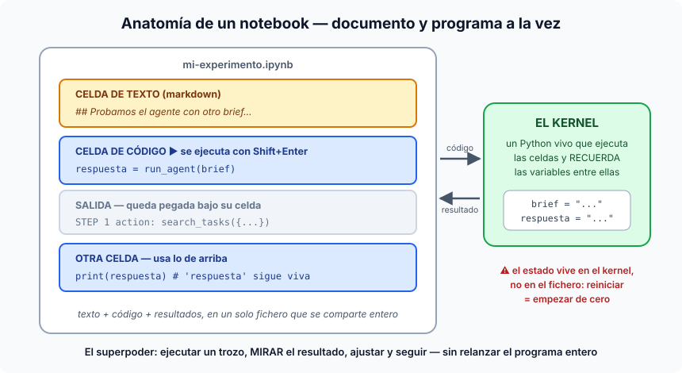

# Notebooks (Jupyter, Colab...) — qué son estos "tableros de celdas"

## Qué es un notebook

Un notebook es un fichero (`.ipynb`) que es **documento y programa a la vez**:
una secuencia de **celdas** que pueden ser de texto (markdown: explicaciones,
títulos, imágenes) o de código Python, donde cada celda de código se ejecuta
por separado (`Shift+Enter`) y **su resultado queda pegado debajo** — texto,
tablas, gráficos. Todo junto en un solo fichero que se comparte entero:
la explicación, el código y lo que salió.

La pieza que lo hace funcionar es el **kernel**: un proceso Python vivo que
ejecuta las celdas y **recuerda las variables entre ellas**. Defines `brief`
en la celda 2 y lo usas en la celda 7 — no hace falta relanzar nada. Ese es el
superpoder: ejecutar un trozo, *mirar* el resultado, ajustar y seguir, sin
volver a correr el programa entero desde cero cada vez.

## Los tres sabores (mismo formato de fichero)

- **Jupyter** — el original y el estándar open source (evolución de IPython;
  el nombre viene de **Ju**lia + **Pyt**hon + **R**). Corre en tu máquina y se
  usa en el navegador.
- **Google Colab** — un Jupyter **hospedado por Google**: cero instalación,
  corres en sus servidores (con GPU gratis si toca), los ficheros viven en tu
  Drive y las claves de API se guardan en su gestor de secretos (el icono de
  la llave 🔑). Es el entorno oficial de este máster para ejercicios sueltos
  (se presenta en la sesión 00).
- **VS Code** — con la extensión **Jupyter** (de Microsoft), los `.ipynb` se
  abren y ejecutan dentro del editor, con el kernel apuntando a tu Python
  local. Mismo fichero, tres sitios donde correrlo.

Como el fichero es el mismo, no hay que elegir: los notebooks de este repo se
corren en VS Code en local **o** se abren en Colab sin instalar nada, con una
URL del tipo
`colab.research.google.com/github/<usuario>/<repo>/blob/main/<ruta>.ipynb`.

## Por qué son omnipresentes en IA

1. **El trabajo con modelos es exploratorio por naturaleza**: pruebas un
   prompt, miras la salida, ajustas, repites. Ese bucle es exactamente lo que
   el notebook optimiza — y lo que un script normal hace incómodo (relanzar
   todo, prints por todas partes).
2. **El resultado se ve al lado del código**: una tabla de tokens, la traza de
   un agente, un gráfico de embeddings. Para entender sistemas cuya salida es
   texto/números variables, verlo en el momento lo es todo.
3. **Son la lengua franca de la enseñanza y la investigación**: papers,
   tutoriales y docs de las librerías de IA vienen como notebooks. Saber
   leerlos y correrlos es alfabetización básica del sector.

## Dónde los usamos en el curso

En `curso-master/sesiones/s12/` hay dos vivos ahora mismo:
`agente-minimo.ipynb` (el bucle agéntico en ~60 líneas, con su traza STEP N) y
`cache-checker.ipynb` (medir el prompt caching de OpenAI con el metadato
`cached_tokens`). Ambos piden solo la `OPENAI_API_KEY` y cuestan céntimos.
El proyecto grande (el `ai-service`) NO es un notebook — y esa frontera es
una lección en sí misma (ver abajo).

## Las dos trampas que hay que contar (con la ficha delante)

1. **El estado vive en el kernel, no en el fichero.** Si ejecutas las celdas
   en desorden, o borras una celda ya ejecutada, el kernel puede tener
   variables que el código visible ya no explica — el clásico "a mí me
   funcionaba y al reiniciar se rompió". Antídoto: de vez en cuando,
   *Restart kernel + Run All* — si no sobrevive a eso, el notebook está mal.
2. **Las salidas se guardan dentro del fichero.** Útil para compartir
   resultados, pero engorda los diffs de git y provoca conflictos de merge
   absurdos (nos pasó en este mismo repo). Antídoto: *Clear All Outputs*
   antes de commitear, salvo que la salida SEA el entregable.

Y la frontera profesional: el notebook es para **explorar y enseñar**; el
código de **producción** vive en módulos con tests (nuestro `ai-service/`).
El flujo maduro es constante: se descubre en un notebook, se consolida en un
módulo. Un notebook de 500 celdas dando servicio a usuarios es una bandera
roja famosa del sector.
