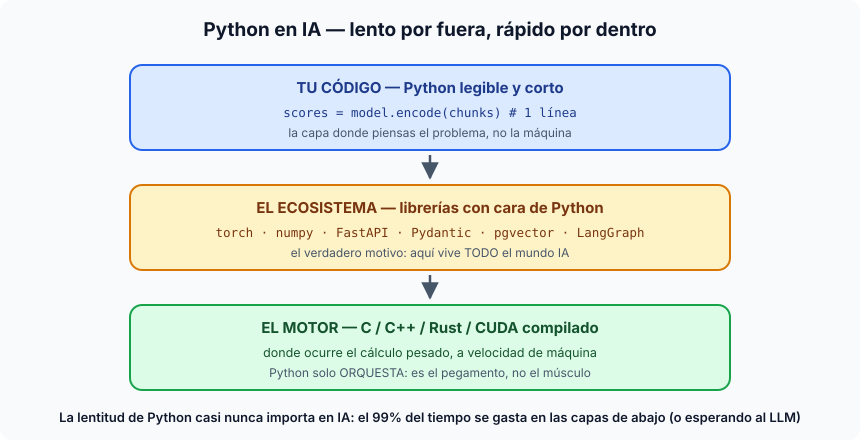

# Python — el lenguaje de la IA (y por qué)

## Qué es

Python es un lenguaje de programación de propósito general, creado por Guido
van Rossum en 1991, open source, **interpretado** (no se compila: un programa
lo lee y ejecuta línea a línea) y **de tipado dinámico** (las variables no
declaran tipo). Su principio fundacional es la legibilidad: el código se
parece al pseudocódigo que escribirías en una pizarra, y los bloques se marcan
con indentación en vez de llaves.

## Qué lo caracteriza

- **Se lee como se piensa**: poca ceremonia, sintaxis mínima. La distancia
  entre la idea y el código funcionando es la más corta del mercado.
- **Baterías incluidas** y un ecosistema de paquetes gigante (PyPI) —
  instalables con `pip`/`uv` en un entorno virtual por proyecto.
- **Interactivo**: consola REPL y notebooks (Jupyter/Colab) — puedes ejecutar
  una línea, mirar el resultado y seguir. Clave para el trabajo exploratorio.
- **Multiparadigma y pragmático**: scripts de 10 líneas o servicios como
  nuestro FastAPI, con el mismo lenguaje.

## Por qué es EL lenguaje de la IA

1. **El ecosistema, y punto.** Toda la investigación en ML de los últimos 15
   años se publicó en Python (numpy → scikit-learn → TensorFlow → PyTorch), y
   el efecto bola de nieve es imparable: cada herramienta nueva de IA sale
   primero (o solo) en Python. Instructor, LangGraph, LiteLLM, presidio,
   sentence-transformers — todo lo que usa este máster — son librerías Python.
2. **El truco de las capas**: Python es lento, pero en IA casi nunca importa,
   porque Python solo *orquesta* — el cálculo pesado ocurre en librerías cuyo
   motor está compilado en C/C++/Rust/CUDA (torch, numpy). Tu código es la
   capa fina y legible de arriba; el músculo está debajo. Y en aplicaciones
   LLM, el 99% del tiempo se va esperando la respuesta de OpenAI: el cuello de
   botella es la red, no el intérprete.
3. **Encaja con el trabajo exploratorio** que la IA exige: probar un prompt,
   mirar la salida, ajustar, repetir. El ciclo notebook/REPL es exactamente
   ese loop.

## Ventajas y desventajas (honestas)

| Ventajas | Desventajas |
|---|---|
| Ecosistema IA sin rival — todo sale aquí primero | **Lento** como intérprete (10–100× vs compilados) cuando el cálculo es Python puro |
| Curva de entrada suave; código legible por no expertos | El **GIL**: un proceso solo ejecuta un hilo de Python a la vez → la concurrencia es un arte (nuestro `docs/scalability.md` es un catálogo de sus consecuencias) |
| Ciclo idea→código→resultado cortísimo (REPL, notebooks) | Tipado dinámico: errores que un compilador cazaría aparecen en runtime — por eso este repo usa type hints + Pydantic en todas las fronteras |
| Pegamento universal: habla con C, con la BBDD, con cualquier API | Empaquetado/entornos históricamente caótico (venv, pip, conda...) — `uv`, el gestor de este proyecto, es la solución moderna |
| Domina también datos, scripting y backend — un solo lenguaje para todo el pipeline | Los despliegues engordan: nuestra imagen con torch lo atestigua (~2,5–4,9 GB) |

## Dónde verlo en el proyecto

Todo `ai-service/` es Python 3.11: FastAPI (la API), Pydantic (los contratos),
SQLAlchemy (la BBDD), torch vía sentence-transformers (el reranker — el
ejemplo perfecto de "capa fina sobre motor compilado"). La gestión de entorno
es con `uv` (`pyproject.toml` + `uv.lock`). Y el contraste está en el propio
repo: el `business-backend` es Ruby/Rails — la frontera entre ambos mundos es
HTTP, y cada lado usa el lenguaje donde su ecosistema es más fuerte. Esa
decisión (Python para la IA, lo-que-sea para el negocio) es en sí misma una
lección de arquitectura del máster.
