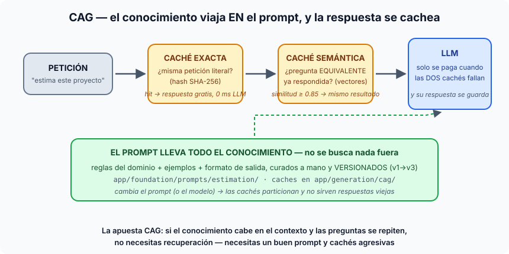

# Píldora — ¿Qué es CAG?

**CAG = Cache Augmented Generation.** La arquitectura donde el conocimiento
que el LLM necesita viaja **dentro del prompt** (curado a mano, versionado) y
el sistema se hace viable a base de **cachear agresivamente** — no hay
recuperación, no hay búsqueda, no hay base de datos de conocimiento.

## La apuesta

Si tu conocimiento **cabe en la ventana de contexto** y **cambia poco**, no
necesitas la maquinaria de búsqueda: métele al modelo todo lo que debe saber
en el prompt (reglas del dominio, ejemplos, formato) y resuelve el coste y la
latencia con cachés. Es la respuesta al reflejo de 2023 de "ponle un RAG a
todo": muchas aplicaciones reales no lo necesitan. Hay hasta paper con el
título perfecto: *"Don't do RAG when CAG is all you need"*.

## Las piezas (todas en nuestro proyecto, S2–S5)

1. **El prompt como base de conocimiento.** Todo lo que el estimador "sabe"
   sobre estimar proyectos vive en las plantillas versionadas
   (`app/foundation/prompts/estimation/v1→v3/`): reglas, ejemplos, formato.
   Curado a mano, con diff en git — el conocimiento es un artefacto.
2. **Caché exacta** (`app/generation/cag/exact.py`): misma petición literal
   (hash SHA-256 del request + versión de prompt + modelo) → misma respuesta,
   sin tocar el LLM. Gratis e instantáneo.
3. **Caché semántica** (`app/generation/cag/semantic.py`): pregunta
   *equivalente aunque escrita distinto* (similitud de vectores ≥ 0.85) →
   sirve la respuesta ya pagada. Es la que convierte "100 usuarios preguntando
   parecido" en 1 llamada al LLM.
4. (En los proveedores, la misma idea un nivel más abajo: el *prompt caching*
   de OpenAI/Anthropic cachea el prefijo largo del contexto entre llamadas —
   CAG a nivel de infraestructura.)

## "¿Pero esto no es una tontería? Es un prompt y una caché"

Sí — **y esa simplicidad es exactamente el punto**. CAG no impresiona en una
demo; impresiona en la factura y en el p99 de latencia. Su valor pedagógico y
profesional es triple:

- Es **la línea base honesta**: antes de montar embeddings, BBDD vectorial,
  chunking y reranking (todo el módulo RAG), la pregunta profesional es
  "¿de verdad no me basta con un buen prompt y cachés?". Muchísimos productos
  en producción son CAG y funcionan de maravilla.
- Ponerle **nombre** convierte una elección implícita en una decisión de
  arquitectura explícita, con sus límites conocidos.
- Define **la frontera que motiva RAG**: CAG rompe cuando el conocimiento no
  cabe en el contexto, cambia a menudo, o necesitas citar de dónde salió cada
  dato. La S6 del máster hace literalmente un *stress test* del CAG para
  "medir dónde rompe" — y de esa rotura nace la necesidad de RAG en la S9.

## CAG vs RAG en una línea

> **CAG: el conocimiento viaja en el prompt y se cachea la respuesta.
> RAG: el conocimiento vive fuera, indexado, y se recupera lo justo por pregunta.**

No compiten: en nuestro proyecto coexisten (el estimador S4 es CAG; el
estimador desde transcripción S9+ es RAG) y las cachés CAG siguen delante de
todo. Ver la píldora hermana: [rag.md](rag.md).
