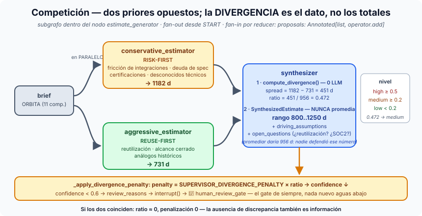

# Píldora — Competición de agentes: la discrepancia como señal

**Competición** es el patrón en el que dos (o más) agentes resuelven **el
mismo problema en paralelo con criterios deliberadamente opuestos**, y el
sistema no se queda con "el ganador" sino con **la distancia entre ellos**.
Un número consolidado esconde la incertidumbre; dos números con priores
distintos la miden.

## La idea en una frase

> Si un estimador dice 1182 días y otro 731, eso no es un error: es
> información.

## Las cuatro piezas

1. **Dos priores, no dos adjetivos.** `conservative_estimator` es
   *RISK-FIRST*: pondera fricción de integraciones, deuda de especificación
   y certificaciones. `aggressive_estimator` es *REUSE-FIRST*: pondera
   reutilización, alcance cerrado y análogos históricos. Los prompts
   (`_CONSERVATIVE_SYSTEM_PROMPT` / `_AGGRESSIVE_SYSTEM_PROMPT`) difieren en
   **criterios**, no en tono — si solo cambiara el adjetivo, los dos
   números serían el mismo número con ruido.
2. **Fan-out / fan-in real.** `build_competition_subgraph()` tiene dos
   aristas desde `START` y un join en `synthesizer`; ambos estimadores
   escriben en `proposals: Annotated[list[dict], operator.add]` — el reducer
   *es* el fan-in (sin él, dos escrituras en el mismo superstep chocan). El
   subgrafo vive **dentro** del nodo `estimate_generator`: el supervisor
   enruta de uno en uno, así que el paralelismo se queda dentro del nodo y
   la [estrella](supervisor-multiagente.md) no se toca.
3. **La divergencia es aritmética.** `compute_divergence(proposals)`:
   `spread = high − low`, `ratio = spread / midpoint`, y un nivel — *high*
   si `ratio ≥ 0.5`, *medium* si `≥ 0.2`, *low* por debajo. Cero LLM
   (`test_divergence_is_pure_arithmetic`): el modelo no juzga cuánto
   discrepa consigo mismo, lo mide el código.
4. **El synthesizer NUNCA promedia.** El esquema `SynthesizedEstimate`
   impone un rango `low..high` más `driving_assumptions` y
   `open_questions`. Promediar 1182 y 731 daría 956 — un número que nadie
   defendió y que borra justo lo que queríamos saber. El rango lo conserva.

## Los números de la demo local

| | Valor |
|---|---|
| `conservative` (RISK-FIRST) | **1182 d** |
| `aggressive` (REUSE-FIRST) | **731 d** |
| `spread` / `midpoint` | 451 d / ≈956 d |
| `ratio` | **0.472** |
| rango sintetizado | **800..1250 d** (confidence *low*) |

Las preguntas abiertas que devolvió el synthesizer son las que un jefe de
proyecto haría: ¿cuánto se reutiliza de la telemetría existente?, ¿qué
complejidad real tiene la UI multiidioma?, ¿hay requisitos SOC2 nuevos? Ojo
al nivel: 0.472 se queda a un pelo del umbral *high* (0.5) — la traza lo
etiqueta *medium*; en la traza oficial del curso (705 vs 1250 d) el ratio es
0.558 y sale *high*. En ambos casos el gate pausó, que es lo que importa.

## Cómo se conecta al gate humano

`_apply_divergence_penalty`: `penalty = SUPERVISOR_DIVERGENCE_PENALTY ×
ratio`, restado a la confianza que `coherence_validator` calcula de forma
determinista. Divergencia alta → confianza baja → `review_reasons` añade el
motivo → `interrupt()`. **Nada nuevo aguas abajo**: la competición se
enchufa al [gate condicional](human-in-the-loop.md) que ya existía. Y si los
dos estimadores coinciden, `ratio ≈ 0` y penalización 0 — la ausencia de
discrepancia también es información.

## Dónde verlo en nuestro proyecto

- `app/domain/graph/supervisor/competition.py` (subgrafo, prompts,
  `compute_divergence`), `agents.py::competitive_estimate_generator` y
  `_apply_divergence_penalty`, `schemas.py` (`EstimateProposal`,
  `SynthesizedEstimate`); knobs `SUPERVISOR_COMPETITION_ENABLED` y
  `SUPERVISOR_DIVERGENCE_PENALTY`.
- `scripts/run_supervisor_s14.py --memory --stub --compete` — traza local
  [01-competicion…](../sesiones/s14/demos/01-competicion-conservador-vs-agresivo.txt)
  y la oficial `exercises/session-14/example_run_competition.txt`. Sección
  `COMPETITION (conservative vs aggressive)` en el resumen.
- `tests/domain/graph/supervisor/test_competition.py`.
- En Rails, `_completed.html.erb` muestra "Rango (competición conservador ↔
  agresivo)" y las preguntas abiertas — sin cambio de contrato.

## El mapa mental para cerrar

Competición no es "dos agentes por si uno falla" (eso es redundancia). Es
usar el desacuerdo estructurado como **instrumento de medida** de la
incertidumbre — y dejar que un número, no una opinión, decida si un humano
tiene que mirar.
