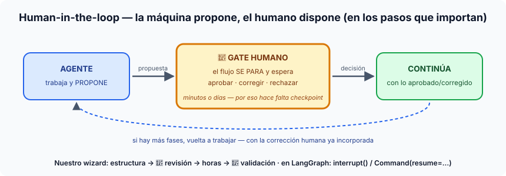

# Píldora — ¿Qué es human-in-the-loop (HITL)?

**Human-in-the-loop** es el patrón por el que un sistema automático **se
detiene en los pasos que importan y espera una decisión humana** — aprobar,
corregir o rechazar — antes de continuar. No es "un humano mirando logs"
(eso es supervisión *a posteriori*): es el humano como **parte del flujo**,
con el sistema parado hasta que responde.

## La idea en una frase

> La máquina propone, el humano dispone — y el flujo no avanza sin él.

## Por qué existe (las tres razones de negocio)

1. **Responsabilidad**: hay decisiones que legal o comercialmente debe firmar
   una persona (un presupuesto que verá un cliente, un reembolso grande, un
   diagnóstico). El agente puede preparar el 95%; la firma es humana.
2. **Calidad donde el error es caro**: revisar UNA estructura propuesta cuesta
   un minuto; deshacer una estimación mal enviada cuesta un cliente.
3. **Confianza progresiva**: los gates son el dial de adopción — se empieza
   aprobando todo, y se van retirando gates conforme el sistema demuestra
   fiabilidad (o se dejan solo para los casos que el propio sistema marca
   como dudosos, como nuestro gate condicional de la S14).

## La consecuencia técnica que nadie ve venir

Un humano tarda **minutos o días** en responder. Eso convierte HITL en un
problema de *infraestructura*, no solo de UX: el flujo tiene que poder
**pausarse, persistirse y reanudarse** — por eso HITL de verdad exige
checkpointing (nivel 4 de la [jerarquía de memoria](memoria.md)). Un bucle en
RAM no puede esperar a un humano que contesta mañana.

## Dónde verlo en nuestro proyecto

- **El wizard (S10/S11)**: `estructura → 🚧 revisión → horas → 🚧 validación`.
  Los dos gates existen desde antes de haber agentes — son del negocio.
- **La S12 entera es una lección de HITL**: el agente one-shot "funciona pero
  atropella las dos puertas"; reencauzarlo respetándolas es el ejercicio.
- **LangGraph (S13/S14)** le pone nombres técnicos: `interrupt()` pausa el
  grafo en mitad de un nodo, el checkpointer guarda el estado en Postgres, y
  `Command(resume=...)` lo reanuda cuando el humano decide — días después si
  hace falta. La S14 añade el gate *condicional*: solo se pausa cuando la
  confianza baja del umbral.

## El mapa mental para cerrar

HITL es el eje 5 de la [ficha de tipos de agentes](tipos-de-agentes.md): a
más autonomía y más runtime le des a un agente, más valen los puntos donde un
humano puede decir "no".
