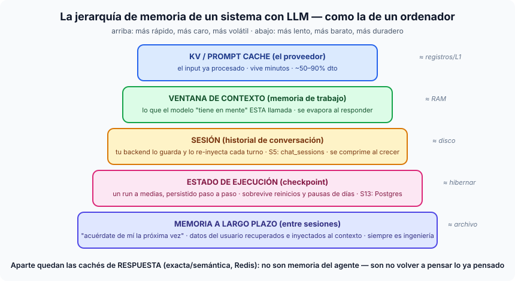

# Píldora — La jerarquía de memoria en sistemas con LLM

Un ordenador tiene una jerarquía de memoria (registros → RAM → disco →
archivo) donde cada nivel cambia velocidad por duración. Un sistema con LLM
tiene **exactamente la misma estructura**, y ponerle los nombres evita la
confusión más común del sector: llamar "memoria" a cinco cosas distintas.

## Los cinco niveles, de más volátil a más duradero

1. **KV / prompt cache (el proveedor).** El input ya procesado por el modelo,
   reutilizable entre llamadas con el mismo prefijo. Vive minutos, ahorra
   50–90% del coste de input. No la controlas — la aprovechas ordenando el
   prompt (estable primero). *≈ registros/L1.* (Detalle completo en la
   píldora [cag.md](cag.md) y el notebook `cache-checker.ipynb`.)
2. **Ventana de contexto (memoria de trabajo).** Lo que el modelo "tiene en
   mente" durante UNA llamada. Se evapora al responder. Todo lo demás de esta
   lista existe para decidir **qué entra aquí** en cada llamada. *≈ RAM.*
3. **Sesión (historial de conversación).** La ilusión de continuidad: tu
   backend guarda los turnos y los re-inyecta (enteros o resumidos) en cada
   llamada. Nuestra S5: `chat_sessions` + compresión cuando crece. *≈ disco.*
4. **Estado de ejecución (checkpoint).** Distinto del historial: es un
   *trabajo a medias* persistido paso a paso, que sobrevive a reinicios y a
   pausas de días esperando a un humano. Nuestra S13: el checkpointer de
   LangGraph en Postgres. *≈ hibernar el portátil.*
5. **Memoria a largo plazo (entre sesiones).** El "acuérdate de mí la próxima
   vez": datos del usuario guardados, recuperados e inyectados al contexto de
   futuras conversaciones. Nunca viene de fábrica — siempre es ingeniería
   (una búsqueda + una inyección). *≈ archivo.*

## La pieza que NO es memoria del agente

Las **cachés de respuesta** (exacta y semántica, Redis — S4) se cuelan en
estas conversaciones y no pertenecen a la jerarquía: no ayudan al agente a
recordar — ahorran **volver a pensar lo ya pensado**, sirviendo una respuesta
anterior tal cual. Es la línea de la píldora CAG: si sirves lo guardado
verbatim es caché; si lo usas como contexto para generar algo nuevo, es
retrieval.

## La regla que ordena todo

> **Cada nivel existe porque el de arriba es demasiado caro o demasiado
> volátil para lo que quieres conservar.** Elegir "qué memoria" no es una
> decisión técnica exótica: es decidir cuánto debe durar cada cosa — una
> llamada, una conversación, un trámite de días, o la relación con el usuario.
