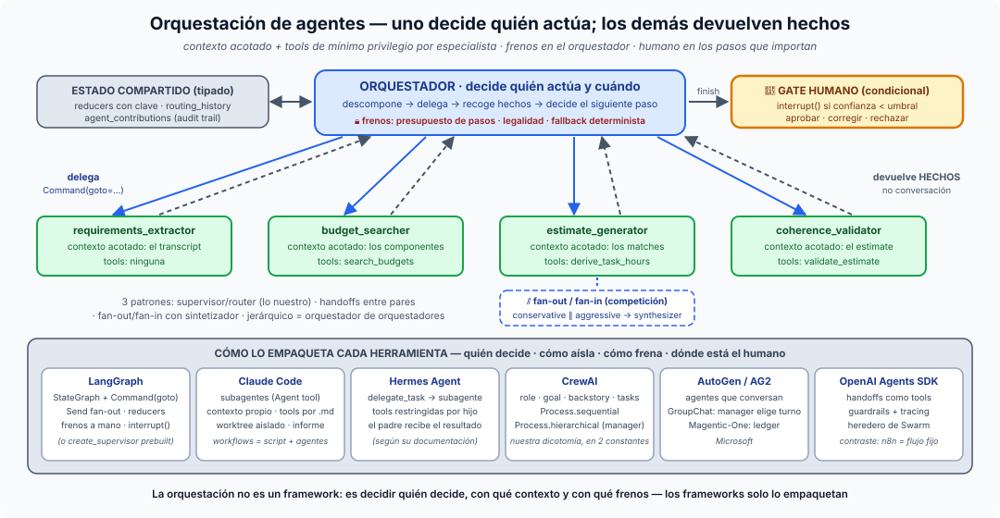

# Píldora — Orquestación de agentes: quién decide, con qué contexto, con qué frenos

**Orquestación** es el patrón en el que un agente (o un grafo) **gobierna a
otros**: descompone el problema, delega cada parte en un especialista, recoge
lo que devuelve y decide el siguiente paso. Los especialistas trabajan con un
contexto y unas herramientas **acotados** — mínimo privilegio — y devuelven
**hechos, no conversación**. No es "muchos agentes hablando": es una
jerarquía explícita de quién decide y quién ejecuta.

## La idea en una frase

> Un orquestador no hace el trabajo: decide quién lo hace, le da solo lo que
> necesita y se queda con los hechos que le devuelve.

## Las tres piezas que siempre están

1. **Descomposición y delegación.** El orquestador lee el estado y elige un
   especialista. En nuestro caso es un LLM que emite `Command(goto=…)`; en
   otros sistemas es un script, un manager o una cola. Lo que importa es que
   el especialista *no* elige a su sucesor.
2. **Contexto acotado y mínimo privilegio.** Cada especialista recibe el
   trozo de estado que necesita y exactamente las tools que su tarea exige
   (`AGENT_PRIVILEGES`: `budget_searcher` → `search_budgets`, y nada más). Es
   el [sandboxing](sandboxing-de-agentes.md) aplicado a la lectura.
3. **Hechos, no conversación.** El especialista escribe en el estado
   (`confidence`, `grounded`, `divergence`), no un párrafo. El orquestador
   decide sobre hechos comparables; una conversación no se puede enrutar.

## Los tres patrones canónicos (y el jerárquico)

- **Supervisor / router**: uno decide, los demás ejecutan y devuelven el
  control. Es lo nuestro: la estrella de la S14 con el
  [supervisor enjaulado](supervisor-multiagente.md).
- **Handoffs entre pares**: un agente cede el control a otro, como si
  llamara a una tool; no hay centro. Es el modelo de OpenAI Agents SDK.
- **Fan-out / fan-in con sintetizador**: varios trabajan en paralelo sobre
  el mismo problema y un nodo junta los resultados. Es nuestra
  [competición](competicion-de-agentes.md): `conservative_estimator ∥
  aggressive_estimator → synthesizer`.
- **Jerárquico**: un orquestador de orquestadores. Nosotros ya lo tenemos en
  pequeño — el subgrafo de competición vive *dentro* del nodo
  `estimate_generator` que el supervisor enruta.

## Lo que resuelve y lo que crea

| Resuelve | Crea |
|---|---|
| tareas que un solo contexto no abarca | ¿contexto compartido o aislado? — el estado tipado con reducers es la respuesta de LangGraph |
| mínimo privilegio real por tarea | ¿quién para el bucle? — un router puede no converger: presupuesto de pasos |
| paralelismo donde lo hay (fan-out) | coste: cada decisión y cada especialista es una llamada |
| trazabilidad: una fila por decisión | idempotencia: un resume reejecuta nodos → reducers con clave, no `operator.add` |

## Cómo lo empaqueta cada herramienta

| Herramienta | Quién decide el siguiente paso | Cómo aísla el contexto | Cómo frena | Dónde está el humano |
|---|---|---|---|---|
| **LangGraph** (lo nuestro) | supervisor a mano con `Command(goto=…)`; fan-out con `Send` o aristas paralelas | `StateGraph` con estado tipado + reducers; cada nodo ve el estado, no la conversación | presupuesto de pasos, guarda de legalidad, fallback determinista | `interrupt()` + checkpointer. Existen `langgraph-supervisor` (`create_supervisor`) y `create_react_agent`, que empaquetan el patrón con handoffs como tools — lo escribimos a mano para ver las tripas |
| **Claude Code** (Anthropic) | el agente principal lanza subagentes (Agent tool); los *workflows* fijan en un script determinista qué agentes corren en paralelo y en qué fases | cada subagente tiene su propia ventana de contexto y las tools permitidas en `.claude/agents/*.md`; puede correr en background y en un git worktree aislado; el orquestador solo recibe el informe final | el conjunto de tools por subagente y el script del workflow | permisos por acción en el agente principal |
| **Hermes Agent** (Nous Research, open source, 2026) | según su documentación, un agente persistente con memoria y skills que delega en subagentes aislados mediante `delegate_task` | tools restringidas por subagente; el padre recibe el resultado, no el contexto del hijo | (no detallado en lo que hemos consultado) | (no detallado en lo que hemos consultado) |
| **CrewAI** | `Process.sequential` (las tareas en el orden que escribes) o `Process.hierarchical` (un manager LLM delega y valida) | agentes con `role` / `goal` / `backstory` y tasks propias | el proceso elegido acota lo que el manager puede reordenar | validación del manager en el modo jerárquico |
| **AutoGen / AG2** (Microsoft) | `GroupChat` con un manager que elige el siguiente speaker; Magentic-One orquesta con un *ledger* de progreso | agentes que conversan; el ledger separa el progreso de la charla | el ledger del orquestador | conversación con un agente humano proxy |
| **OpenAI Agents SDK** | handoffs: un agente cede el control a otro como si fuera una tool (heredero de Swarm) | cada agente lleva sus instrucciones y tools | guardrails | tracing para auditar después |
| **n8n** (contraste) | el workflow dibujado: el nodo AI Agent decide solo dentro de su caja | cada nodo recibe lo que el flujo le pasa | el flujo fijo — "autonomía acotada dentro de un flujo fijo" | nodos de aprobación del propio workflow |

La lectura útil de la tabla: las cuatro columnas son las mismas preguntas
en todas las filas. Cambia el azúcar sintáctico, no la disciplina. Y el
contraste Claude Code / n8n muestra que **orquestación determinista y
ejecución agéntica se mezclan bien**: un script fija las fases, cada agente
decide dentro de la suya — ver [secuencial vs agéntico](secuencial-vs-agentico.md).

## Dónde verlo en nuestro proyecto

- `app/domain/graph/supervisor/supervisor.py` (el orquestador: `SupervisorDecision`,
  `_is_legal`, `_fallback_next`), `build.py` (la estrella y las
  `destinations` explícitas), `privilege.py` (`AGENT_PRIVILEGES`,
  `guarded_dispatch`: la delegación con tools acotadas), `agents.py` (los
  especialistas como funciones puras `state → partial update`),
  `competition.py` (fan-out / fan-in con `synthesizer`).
- `scripts/run_supervisor_s14.py --memory --stub --compete` — traza
  [01-competicion…](../sesiones/s14/demos/01-competicion-conservador-vs-agresivo.txt);
  con `--violate`, la [03-denegacion…](../sesiones/s14/demos/03-denegacion-privilegio-tool-no-concedida.txt)
  muestra un `[DENIED]` real: la delegación no es de confianza, es de contrato.
- `tests/domain/graph/supervisor/`: `test_supervisor_routing.py` (quién
  decide), `test_privilege.py` (con qué tools), `test_competition.py`
  (fan-in), `test_failure_modes.py` (quién para el bucle).

## El mapa mental para cerrar

La orquestación no es un framework: es la disciplina de decidir **quién
decide, con qué contexto y con qué frenos**. Los frameworks solo la
empaquetan. Cuando el orquestador es un modelo, el código sigue siendo dueño
de la jaula ([supervisor](supervisor-multiagente.md)); cuando el error es
caro, el último orquestador es una persona ([human-in-the-loop](human-in-the-loop.md)).
