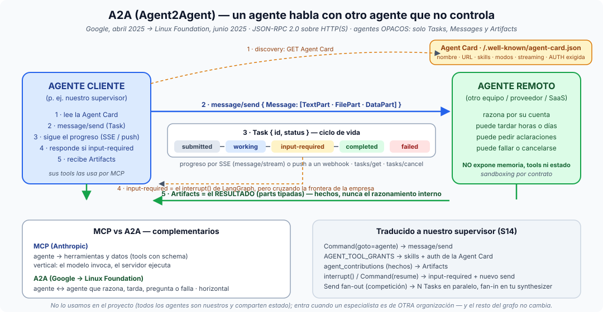

# Píldora — ¿Qué es el protocolo A2A (Agent2Agent) de Google?

**A2A = Agent2Agent.** Un protocolo abierto para que **un agente hable con otro
agente** que no controla — de otro equipo, de otro proveedor, de otra empresa —
sin compartir su código, sus prompts ni sus herramientas. Lo presentó Google en
abril de 2025 con ~50 socios, lo donó a la **Linux Foundation** en junio de 2025
y hoy es un estándar neutral con SDKs oficiales (Python, JS, Java, .NET, Go).

## La idea en una frase

> **MCP conecta a un agente con sus herramientas; A2A conecta a un agente con
> otros agentes.** Son complementarios, no rivales.

## El problema que resuelve

Todo lo que hemos construido en el módulo 5 (el supervisor, los cuatro
especialistas, la competición) vive **dentro del mismo proceso**: un solo
`StateGraph`, un estado tipado compartido, un `dispatch` que conoce todas las
tools. Eso funciona mientras todos los agentes sean tuyos.

En cuanto el "especialista" es un agente de **otra organización** (el agente de
compras de un proveedor, el agente de RRHH de otro departamento, un agente SaaS),
no puedes compartir el estado, no conoces sus tools y no quieres que él conozca
las tuyas. Necesitas un **contrato de red**: cómo lo descubro, cómo le pido algo,
cómo sigo el progreso, cómo me devuelve el resultado y cómo me pide ayuda a
mitad de camino. Eso es A2A.

## Las piezas (según la especificación)

1. **Agent Card** — un JSON público en `/.well-known/agent-card.json` (en las
   primeras versiones `agent.json`) que describe al agente: nombre, URL,
   *skills* que ofrece, modos de entrada/salida, si soporta streaming y push, y
   **qué autenticación exige**. Es el *discovery*: lo lees antes de hablar con
   él. Fíjate en la analogía con nuestra tabla de privilegios: aquí la
   "concesión" es pública y la declara el propio agente.
2. **Transporte** — **JSON-RPC 2.0 sobre HTTP(S)**; la versión 0.3 añadió
   bindings gRPC y REST equivalentes. Nada exótico: cabe en cualquier stack.
3. **Task** — la unidad de trabajo. El agente cliente envía un mensaje
   (`message/send`) y el remoto responde con una **Task** que tiene ciclo de
   vida: `submitted → working → (input-required) → completed | failed |
   canceled`. Cada Task tiene un `id` y se puede consultar (`tasks/get`) o
   cancelar (`tasks/cancel`).
4. **Message y Part** — los mensajes van dentro de la Task y se componen de
   *parts* tipadas: `TextPart`, `FilePart`, `DataPart` (JSON estructurado).
   Multimodal por diseño.
5. **Artifact** — el **resultado** que el agente remoto produce (también hecho
   de parts). Es el equivalente a nuestros "hechos, no conversación": el
   cliente recibe artefactos, nunca el razonamiento interno del otro.
6. **Streaming y push** — `message/stream` devuelve eventos por **SSE**
   (progreso, artefactos parciales); para tareas largas hay **push
   notifications** a un webhook del cliente. Piensa en nuestras pausas
   humanas de días: el estado `input-required` es exactamente el
   `interrupt()` de LangGraph, pero cruzando la frontera de la organización.
7. **Agentes opacos** — principio de diseño: ningún agente expone su memoria,
   sus tools ni su estado interno. Solo Tasks, Messages y Artifacts. Es
   *sandboxing por contrato*: no puedes invocar lo que el otro no anuncia.

## Cómo encaja con lo que hemos hecho (S12–S14)

| Nuestro proyecto (mismo proceso) | A2A (entre procesos / empresas) |
|---|---|
| `Command(goto=agente)` del supervisor | `message/send` al agente remoto |
| `AGENT_PRIVILEGES` / `AGENT_TOOL_GRANTS` | *skills* + auth declarados en la **Agent Card** |
| Estado tipado compartido (`SupervisorState`) | **No hay estado compartido**: solo Task + Artifacts |
| `agent_contributions` (hechos, no conversación) | **Artifacts** |
| `interrupt()` + `Command(resume=…)` | Task en `input-required` + nuevo `message/send` con la respuesta |
| `routing_history` / audit trail | `tasks/get` + eventos SSE (el cliente guarda su propio trail) |
| `Send` fan-out (competición) | N Tasks en paralelo a N agentes remotos, fan-in en tu synthesizer |

La lección de fondo es la misma que la de la [orquestación](orquestacion-de-agentes.md):
un orquestador **delega, recoge hechos y decide**; A2A solo cambia el cable —
de una llamada de función a una llamada HTTP con contrato — y con ello obliga
a hacer explícito lo que dentro del proceso dábamos por hecho (autenticación,
descubrimiento, ciclo de vida, cancelación).

## MCP vs A2A (la pregunta que siempre cae)

- **MCP** (Anthropic): un *agente* habla con *tools y datos* — un servidor
  expone herramientas con schema y el modelo las invoca. Vertical: agente →
  mundo.
- **A2A** (Google → Linux Foundation): un *agente* habla con *otro agente* que
  razona por su cuenta y puede tardar, pedir aclaraciones o fallar.
  Horizontal: agente ↔ agente.
- En la práctica se combinan: tu agente usa **MCP** para sus tools y **A2A**
  para pedir ayuda a agentes ajenos. Google ADK, LangGraph (vía `a2a-sdk`),
  Semantic Kernel o CrewAI ya tienen integraciones; y desde 2025 A2A y MCP
  conviven bajo paraguas neutrales (Linux Foundation).

## Dónde verlo en nuestro proyecto (y por qué NO está)

No lo tenemos, y es una decisión correcta: nuestros cuatro especialistas son
del mismo equipo y comparten estado — envolverlos en HTTP sería añadir latencia
y fricción a cambio de nada. A2A entra cuando el `budget_searcher` fuese, por
ejemplo, el agente de un proveedor de presupuestos externo: entonces el
supervisor haría `message/send`, recibiría una Task, esperaría el Artifact con
los análogos y seguiría igual. El resto del grafo —frenos, gate humano,
sandboxing de la escritura— **no cambiaría**, que es la prueba de que la
orquestación es una disciplina y no un protocolo.

## El mapa mental para cerrar

Dentro de tu proceso: [supervisor](supervisor-multiagente.md) + estado tipado +
[mínimo privilegio](sandboxing-de-agentes.md). Fuera de tu proceso: los mismos
principios, expresados como Agent Card + Task + Artifact. Y en ambos casos, el
[humano](human-in-the-loop.md) sigue teniendo su puerta: `interrupt()` dentro,
`input-required` fuera.
