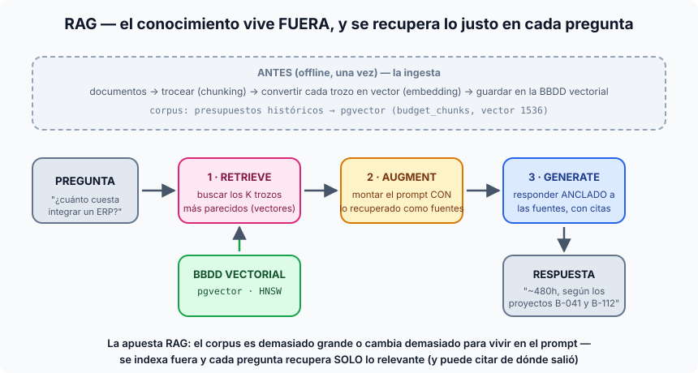

# Píldora — ¿Qué es RAG?

**RAG = Retrieval Augmented Generation.** La arquitectura donde el
conocimiento vive **fuera del prompt** — indexado en una base de datos
vectorial — y en cada pregunta se **recupera solo lo relevante** para que el
LLM responda anclado a esas fuentes (y pueda citarlas).

## El problema que resuelve

Un LLM solo sabe dos cosas: lo que aprendió entrenando (congelado, genérico) y
lo que le metas en el contexto de la llamada. Cuando tu conocimiento es
**grande** (miles de documentos que no caben en la ventana), **cambiante**
(se añaden presupuestos cada semana) o **verificable** (necesitas saber de qué
documento salió cada dato), meterlo entero en el prompt (CAG) deja de ser
viable. RAG lo saca fuera y lo trae a demanda.

## Las dos mitades

### Offline — la ingesta (se hace una vez, y al actualizar el corpus)

1. **Trocear** los documentos en fragmentos con sentido (*chunking* — S7).
2. **Vectorizar** cada trozo: un modelo de embeddings lo convierte en un
   vector de números que captura su *significado* (S7).
3. **Indexar** los vectores en una BBDD vectorial para buscar por similitud a
   velocidad (pgvector + índices HNSW — S8).

### Online — cada pregunta (las 3 etapas + 1)

1. **Retrieve**: vectorizar la pregunta y buscar los K trozos más cercanos
   (con umbral de relevancia, filtros de metadatos, búsqueda híbrida
   vector+texto, reranking... — S9–S10).
2. **Augment**: montar el prompt con lo recuperado como bloque de fuentes
   delimitadas (nuestros `<source id="...">`), dentro de un presupuesto de
   tokens.
3. **Generate**: el LLM responde **anclado a esas fuentes**, citándolas — y se
   verifica que las citas existen y que no alucina (S11).

(La etapa 0 que suele olvidarse: **reformular** la pregunta del usuario antes
de buscar — una transcripción de reunión no es una buena query.)

## La seña de identidad: la cita

La diferencia visible entre un chat "que se lo sabe" y un RAG bien hecho:
la respuesta dice *de dónde* salió cada dato ("~480h, según los proyectos
B-041 y B-112"). Eso convierte la salida en algo **auditable** — puedes abrir
la fuente y comprobarlo. Sin recuperación no hay nada que citar.

## Dónde verlo en nuestro proyecto (S7–S11)

- Corpus: presupuestos históricos sintéticos → `documents` + `budget_chunks`
  en pgvector (embeddings de 1536 dimensiones + `tsvector` para híbrida).
- Retrieval: `app/generation/rag/` — `retrieve()` con top-K, umbral de
  distancia, filtros, reranking opcional por cross-encoder.
- El flujo completo: `POST /v1/estimate/from-transcript` (reformular → buscar
  → ensamblar `<source>` → generar → validar citas) y el wizard de Rails
  (`/rag/estimation_runs`).

## RAG vs CAG en una línea

> **RAG: el conocimiento vive fuera, indexado, y se recupera lo justo por pregunta.
> CAG: el conocimiento viaja en el prompt y se cachea la respuesta.**

La decisión profesional no es "cuál es mejor" sino **dónde está tu corpus en
tres ejes**: tamaño (¿cabe en el contexto?), volatilidad (¿cuánto cambia?) y
trazabilidad (¿hay que citar?). Pequeño + estable + sin citas → CAG. Grande o
cambiante o auditable → RAG. Ver la píldora hermana: [cag.md](cag.md).

Y hay una tercera vía sin índice — enviar un agente a explorar los ficheros
directamente: [scout-retrieval.md](scout-retrieval.md).
