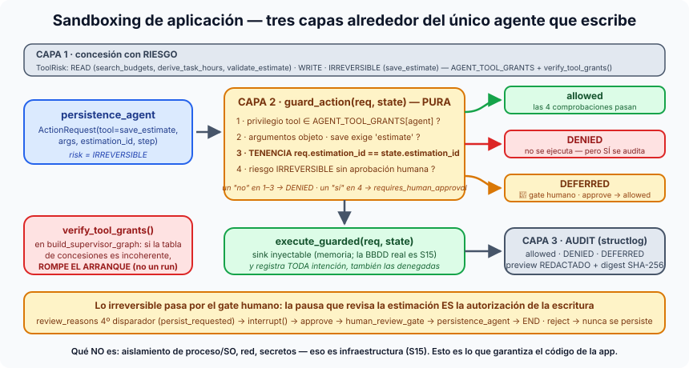

# Píldora — Sandboxing de agentes a nivel de aplicación

**Sandboxing a nivel de aplicación** es contener a un agente con capacidad de
escritura **sin salir del código de la app**: clasificar cada tool por
riesgo, verificar cada intención antes de ejecutarla y auditar todas —
incluidas las denegadas. No es aislamiento de proceso ni de sistema
operativo (eso llega en la S15): es lo que un ingeniero puede garantizar con
una tabla, una función pura y un log.

## La idea en una frase

> Los cuatro agentes de lectura no pueden guardar ni por accidente; el único
> que escribe lo hace después de que un humano haya dicho que sí.

## Las tres capas

1. **Concesión con riesgo.** Cada tool lleva un `ToolRisk` — `READ`,
   `WRITE` o `IRREVERSIBLE` (`TOOL_RISK`: `save_estimate = IRREVERSIBLE`).
   `AGENT_TOOL_GRANTS` deriva de la tabla `AGENT_PRIVILEGES` del
   [supervisor](supervisor-multiagente.md) y añade un solo agente nuevo:
   `persistence_agent → {save_estimate}`. Y `verify_tool_grants()`, llamado
   desde `build_supervisor_graph`, lanza `GrantVerificationError` si la tabla
   es incoherente: **rompe el arranque**, no un run a las tres de la mañana.
   (Demo relámpago: añade `"rogue": frozenset({"delete_all"})` y arranca.)
2. **Validación antes de ejecutar.** `guard_action(req, state) ->
   GuardDecision` es pura y determinista, y comprueba en este orden:
   *privilegio* (`tool ∈ AGENT_TOOL_GRANTS[agent]`) → *argumentos* (son un
   objeto; `save_estimate` exige `estimate`) → **tenencia**
   (`req.estimation_id == state.estimation_id`: un agente del run A no puede
   escribir en el run B, ni aunque el modelo lo pida) → *riesgo*
   (`IRREVERSIBLE` sin aprobación humana → `requires_human_approval`).
3. **Auditoría de toda intención.** `execute_guarded(req, state)` registra
   `allowed`, `DENIED` o `DEFERRED` con el `estimation_id`, un preview de
   los argumentos **redactado** (`_redact`, acotado por
   `SUPERVISOR_AUDIT_ARGS_PREVIEW_CHARS`) y el **digest SHA-256** completo:
   la identidad de la llamada es demostrable sin volcar la transcripción.
   La escritura va a un *sink* inyectable (en memoria por defecto — la
   base de datos real es cosa de la S15).

## La pausa humana es la autorización de la escritura

Las acciones irreversibles no tienen un mecanismo propio: se enrutan **al
mismo gate humano** que revisa la estimación. `review_reasons` gana un
cuarto disparador — `persist_requested` → *"an irreversible save_estimate
is queued; the human pause authorises the write"* — y el grafo una arista
`human_review_gate → persistence_agent → END`. Si el revisor rechaza, la
estimación **nunca se persiste** (queda `deferred`). Ni pantalla nueva, ni
concepto nuevo: la [pausa HITL](human-in-the-loop.md) ya era el sitio donde
un humano firma.

## Dos trazas reales

- `--persist`: `HUMAN REVIEW` muestra el cuarto motivo; tras `approve`, el
  audit trail registra `[ok] persistence_agent tool:save_estimate —
  estimate persisted (guarded, human-authorised)` con `risk=irreversible`.
- `--violate`: `budget_searcher` intenta `validate_estimate` (tool que no
  tiene). Fila `[DENIED]` en el audit trail + evento
  `agent_privilege_denied` a nivel *error*; el run **sobrevive** y termina
  normal porque `SUPERVISOR_PRIVILEGE_STRICT=false` (con `true` levanta
  `PrivilegeViolation`). La llamada la inyecta el *script* — en producción
  no hay ningún código que la haga.

## Qué NO es

Es sandboxing **de aplicación**: no hay aislamiento de proceso ni de SO, no
se limita la red ni el sistema de ficheros, no se gestionan secretos — todo
eso es infraestructura y es la S15. En la [ficha de agentes](tipos-de-agentes.md)
es el eje 4: el runtime define el daño máximo posible, y aquí el runtime
sigue siendo "enjaulado, tools contadas". Lo que añade la S14 es que la
única tool que escribe está vigilada tres veces y firmada por una persona.

## Dónde verlo en nuestro proyecto

- `app/domain/graph/supervisor/sandbox.py` (`ToolRisk`, `TOOL_RISK`,
  `AGENT_TOOL_GRANTS`, `verify_tool_grants`, `guard_action`,
  `execute_guarded`), `privilege.py` (`guarded_dispatch`, la capa de
  lectura), `agents.py::persistence_agent`, `gate.py` (cuarto disparador),
  `build.py` (flag `sandboxed` + `verify_tool_grants`).
- `scripts/run_supervisor_s14.py --memory --stub --persist` y `--violate`;
  trazas locales
  [02-sandboxing…](../sesiones/s14/demos/02-sandboxing-escritura-autorizada.txt)
  y [03-denegacion…](../sesiones/s14/demos/03-denegacion-privilegio-tool-no-concedida.txt);
  oficial `exercises/session-14/example_run_persistence.txt`.
- `tests/domain/graph/supervisor/test_sandbox.py`
  (`test_estimation_id_mismatch_is_denied` es el de tenencia).
- En Rails, `_audit_trail.html.erb` resalta `save_estimate` con los badges
  **IRREVERSIBLE** y **DIFERIDA** (amarillo mientras esperaba aprobación).
