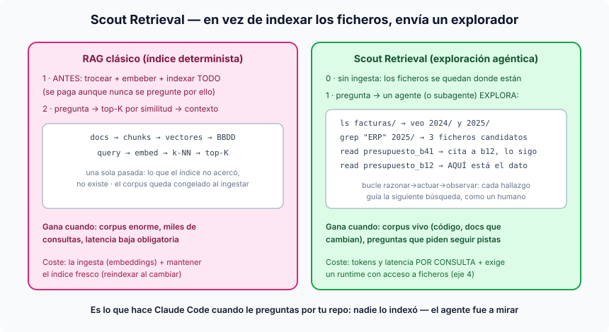

# Píldora — Scout Retrieval: recuperación por exploración agéntica

*(Nombre bautizado en este curso: la técnica existe y se usa a diario — es
como Claude Code encuentra cosas en tu repo — pero la industria aún no le ha
dado un nombre asentado; lo más cercano es el genérico "agentic search". Aquí
la llamamos **Scout Retrieval**: en vez de indexar los documentos, envías un
explorador.)*

## La idea en una frase

En lugar de trocear, vectorizar e indexar un corpus para buscar por similitud
(RAG), le das a un agente **herramientas de navegación** — listar carpetas,
buscar texto, leer ficheros — y él **explora heurísticamente**, como lo haría
una persona: mira dónde está, sigue pistas, y cada hallazgo guía la siguiente
búsqueda.



## El contraste con sus dos hermanos

- **RAG clásico**: recuperación **determinista de una pasada** — embeber la
  pregunta, k-NN, top-K, fin. Rapidísimo y escalable, pero ciego a lo que el
  índice no acercó, y el corpus queda congelado en el momento de la ingesta.
- **GraphRAG y variantes**: mejora el índice (entidades, relaciones) pero
  sigue siendo una estructura **precomputada** que hay que construir y
  mantener.
- **Scout Retrieval**: no hay índice. Hay un **bucle ReAct aplicado a
  buscar**: `ls` para orientarse → `grep` para acotar → `read` para
  confirmar → y si el documento cita a otro, **lo sigue** — el salto que
  ningún top-K da. La recuperación deja de ser una función y pasa a ser un
  *proceso con criterio*.

La secuencia canónica (la que hace Claude Code cuando le preguntas por tu
repo, y nadie lo indexó jamás):

```
ls  facturas/           → veo 2024/ y 2025/
grep "ERP" 2025/        → tres ficheros candidatos
read presupuesto_b41    → cita al proyecto b12, lo sigo
read presupuesto_b12    → aquí está el dato → respondo citándolo
```

## El patrón potente: el subagente scout

La forma madura de usarlo: el agente principal **no explora él** — despacha un
**subagente** con la pregunta ("busca en `facturas/` qué proyectos de ERP
superaron las 400 h") y recibe de vuelta solo la respuesta destilada con sus
rutas. Dos ventajas: el contexto del principal no se llena de basura
intermedia (los `ls` y falsos candidatos mueren con el scout), y puedes
lanzar varios scouts en paralelo sobre carpetas distintas. Es exactamente lo
que hace Claude Code con sus agentes de exploración.

## Cuándo gana cada uno (la tabla de decisión)

| | RAG (índice) | Scout Retrieval |
|---|---|---|
| Corpus | enorme y estable | vivo, que cambia a diario (código, docs de trabajo) |
| Frescura | la del último reindexado | **siempre actual** — lee el fichero de hoy |
| Coste fijo | ingesta + mantener el índice | **cero** |
| Coste por consulta | céntimos, ms | tokens y segundos (varias llamadas LLM) |
| Tipo de pregunta | "qué se parece a X" | "encuentra X **siguiendo pistas**" |
| Requisito | BBDD vectorial | un **runtime con acceso a ficheros** (eje 4 de la [ficha de agentes](tipos-de-agentes.md)) |

Regla práctica: **miles de consultas por día sobre un corpus estable → RAG;
consultas valiosas y espaciadas sobre material vivo → scout**. Y no son
excluyentes: el híbrido serio usa el índice para aterrizar en la zona
correcta y el scout para rematar con precisión.

## Por qué no lo hacíamos antes (y ahora sí)

Scout Retrieval era impracticable con los modelos de 2023: exige muchos pasos
de razonamiento fiable y contextos largos baratos. Es la técnica que los
modelos actuales han vuelto viable — por eso todavía no tiene nombre de
libro: la práctica ha ido por delante del vocabulario. De ahí este bautizo.

Ver también: [rag.md](rag.md) · [cag.md](cag.md) · [tipos-de-agentes.md](tipos-de-agentes.md)
