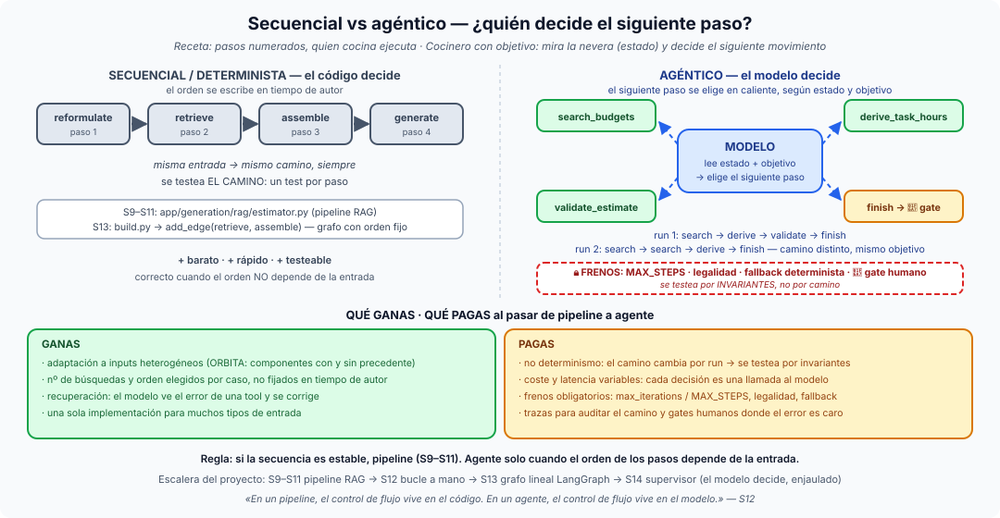

# Píldora — Secuencial vs agéntico: ¿quién decide el siguiente paso?

**Secuencial (determinista)** es resolver un problema escribiendo el orden de
los pasos **en tiempo de autor**: el programador fija la secuencia, la misma
entrada recorre siempre el mismo camino y se testea *ese camino*. **Agéntico**
es dejar que el modelo decida **en caliente** el siguiente paso a partir del
estado y del objetivo: el camino es distinto en cada run y se testea por
invariantes. No es "más listo" contra "más tonto": es un cambio de dónde vive
el control de flujo — y de qué estás dispuesto a pagar por moverlo.

## La idea en una frase

> En un pipeline, el control de flujo vive en el código. En un agente, el
> control de flujo vive en el modelo. (La frase pivote de la S12.)

## La pizarra: receta vs cocinero

- **Receta (secuencial)**: pasos numerados. Quien cocina no decide, ejecuta;
  si falta un ingrediente, la receta no sabe qué hacer. Nuestro pipeline RAG
  de la S9–S11 es una receta: `reformulate_query → retrieve → build_context
  → generate_estimate → verify_citations`, siempre en ese orden.
- **Cocinero con un objetivo (agéntico)**: "haz una cena para cuatro con lo
  que hay". Mira la nevera (estado), decide el siguiente movimiento, prueba,
  corrige. Nuestro agente de la S12 es ese cocinero: decide cuántas búsquedas
  de presupuestos hace, en qué orden, y cuándo ha terminado.

La diferencia no está en los ingredientes ni en los fogones — las tools son
las mismas — sino en **quién elige el siguiente paso**. Es el eje 1 de la
[ficha de tipos de agentes](tipos-de-agentes.md).

## Qué ganas y qué pagas

**Ganas adaptación a inputs heterogéneos.** El transcript ORBITA mezcla
componentes con precedente histórico (un backend de negocio) y sin él (una
telemetría a medida). Un pipeline hace una búsqueda por componente, pase lo
que pase; un agente busca dos veces donde hay duda y ninguna donde ya sabe
que no hay nada. Ganas también recuperación: el modelo ve el error de una
tool y se corrige, en vez de tumbar el flujo.

**Pagas cuatro cosas**, y las cuatro son infraestructura:

1. **No determinismo**: el mismo transcript da caminos distintos → ya no se
   testea el camino, se testean [invariantes](testear-invariantes.md).
2. **Coste y latencia variables**: cada decisión es una llamada al modelo.
3. **Frenos**: un bucle que puede no terminar necesita `max_iterations`
   (S12) o `SUPERVISOR_MAX_STEPS` + guarda de legalidad + fallback (S14).
4. **Trazas y gates humanos**: si nadie escribió el camino, hay que poder
   leerlo después (`AgentTrace`, `routing_history`) y pararlo donde el error
   es caro ([human-in-the-loop](human-in-the-loop.md)).

## Cuándo NO conviene lo agéntico

Si la secuencia es estable, **un pipeline es más barato, más rápido y más
testeable**, y no hay nada que ganar dándole el volante al modelo. Las S9–S11
son pipelines y están bien así: reformular, recuperar, generar y verificar
siempre van en ese orden, y cada etapa tiene su test unitario y su endpoint
de enseñanza (`/v1/estimate/stages/*`). La pregunta útil no es "¿puedo hacerlo
agéntico?" sino "¿el orden de los pasos depende de la entrada?". Si la
respuesta es no, escribe el orden.

CrewAI lo hace explícito en su API: `Process.sequential` ejecuta las tareas
en el orden que escribes; `Process.hierarchical` deja que un manager LLM
delegue. Es exactamente esta dicotomía con dos constantes.

## La escalera del proyecto

| Sesión | Quién decide | Dónde está |
|---|---|---|
| S9–S11 | el código: pipeline RAG fijo | `app/generation/rag/estimator.py`, `retriever.py`, `query_reformulator.py` |
| S12 | el modelo, en un bucle a mano sobre la Responses API | `app/generation/agentic/agent_loop.py` (`run_structure_agent`, `max_iterations`) |
| S13 | el código, como grafo explícito con estado tipado | `app/domain/graph/build.py` (aristas fijas; `fan_out_hours` con `Send`) |
| S14 | el modelo, enjaulado: un router elige el especialista | `app/domain/graph/supervisor/supervisor.py`, `build.py` (la estrella) |

La escalera no es "de peor a mejor": la S13 *vuelve* a poner el control en el
código a propósito, para ganar persistencia y observabilidad antes de volver
a cedérselo al modelo en la S14 — esta vez con tres frenos y un audit trail.

## Dónde verlo en nuestro proyecto

- La frase pivote y el bucle razonar→actuar→observar: `sesiones/s12/guion.md`.
- El contraste directo: `scripts/run_graph_s13.py` (camino fijo, misma traza
  siempre) frente a `scripts/run_supervisor_s14.py --memory --stub`, cuya
  traza [01-competicion…](../sesiones/s14/demos/01-competicion-conservador-vs-agresivo.txt)
  muestra cinco decisiones `[llm]` que ningún fichero fija de antemano.
- Cómo se testea lo que no tiene camino:
  `tests/domain/graph/supervisor/test_supervisor_routing.py` y
  `test_failure_modes.py` (el ping-pong que el presupuesto de pasos corta).

## El mapa mental para cerrar

Un agente es un pipeline cuyo orden lo escribe el modelo en cada run. En
cuanto hay **más de un agente decidiendo**, aparece la segunda pregunta:
quién gobierna quién actúa y cuándo. Eso es la
[orquestación de agentes](orquestacion-de-agentes.md), y nuestra respuesta
concreta es el [supervisor enjaulado](supervisor-multiagente.md).
