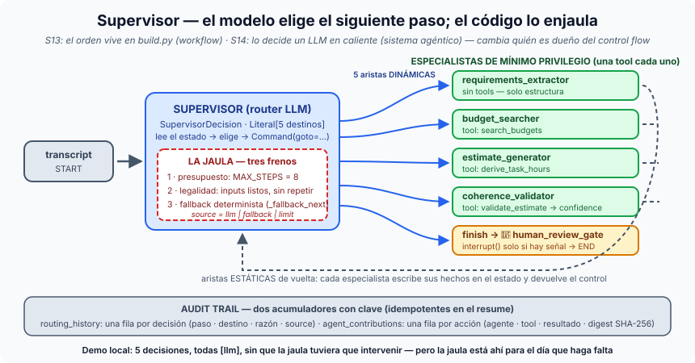

# Píldora — El patrón supervisor: un router LLM enjaulado

**Supervisor** es el patrón multi-agente en el que un nodo central — el
*router* — lee el estado compartido y **decide qué especialista actúa a
continuación**; el especialista trabaja, escribe sus hechos en el estado y
devuelve el control al supervisor, que vuelve a decidir. En la S14 ese router
es un LLM: por primera vez en el módulo **el modelo es dueño del control
flow**. Y precisamente por eso va dentro de una jaula.

## La idea en una frase

> El modelo elige el siguiente paso; el código decide qué elecciones son
> legales, cuántas puede tomar y qué pasa cuando se equivoca.

## La diferencia con la S13: quién es dueño del control flow

- **Grafo lineal (S13)**: el orden vive en `build.py` — aristas secuenciales
  (o `Command` con destino fijo en la variante del directo). El modelo
  *rellena* nodos, pero nunca elige cuál viene después. Es un workflow.
- **Supervisor (S14)**: una **estrella**. `START → supervisor`, cinco aristas
  *dinámicas* `Command(goto=…)` hacia `requirements_extractor`,
  `budget_searcher`, `estimate_generator`, `coherence_validator` o `finish`,
  y aristas *estáticas* de vuelta al supervisor. El grafo obedece lo que el
  modelo decide. Es la frontera entre workflow y sistema agéntico — el eje 1
  de la [ficha de tipos de agentes](tipos-de-agentes.md).

La consecuencia técnica: aristas cíclicas + un router que puede equivocarse
= un grafo que puede no terminar nunca, o mandar a un agente cuyos inputs
todavía no existen. De ahí los tres frenos.

## Los tres frenos de la jaula

1. **Presupuesto de pasos** (`SUPERVISOR_MAX_STEPS`, por defecto 8). Techo
   duro: cuatro agentes, hueco para un re-enrutado legítimo, y `finish`. Es
   la red de seguridad, no el arreglo — un ping-pong `requirements → budget
   → requirements …` termina igual, pero gastando 8 pasos y 8 llamadas.
2. **Guarda de legalidad**. La decisión es un `SupervisorDecision` con el
   destino restringido por `Literal` a los cinco valores posibles; después
   el código comprueba que el elegido tiene sus inputs listos y no ha
   actuado ya (`_inputs_ready(target, history) and not
   _already_ran(target, history)`). Una elección ilegal nunca se convierte
   en un `Command`.
3. **Escalera de fallback determinista** (`_fallback_next`). Si el modelo
   falla, contesta algo ilegal o se agota el presupuesto, el código elige el
   siguiente por la escalera de dependencias. El campo `source` de cada
   decisión registra quién decidió de verdad — en la traza se lee
   `supervisor → budget_searcher [llm]`, y sería `[fallback]` o `[limit]`
   si la jaula hubiera intervenido.

No hay perilla de temperatura: el determinismo viene del esquema
restringido y de la guarda, no del sampling.

## La estrella de agentes de mínimo privilegio

| Agente | Tools concedidas |
|---|---|
| `supervisor` | ninguna (solo decide) |
| `requirements_extractor` | ninguna (solo genera estructura) |
| `budget_searcher` | `search_budgets` |
| `estimate_generator` | `derive_task_hours` |
| `coherence_validator` | `validate_estimate` |

Cada especialista recibe **exactamente una tool**, declarada en la tabla
`AGENT_PRIVILEGES`. `guarded_dispatch` comprueba la lista antes de delegar
en el `dispatch_tool` de la S12: una llamada denegada nunca llega a la tool y
aparece como `[DENIED]` en el audit trail. Es la misma idea que el
[sandboxing](sandboxing-de-agentes.md), aplicada a la lectura.

## El audit trail: dos acumuladores con clave

- `routing_history`: una fila por decisión del supervisor (paso, destino,
  razón, `source`).
- `agent_contributions`: una fila por acción de un agente (agente, acción,
  resultado, `args_digest` SHA-256, duración).

Ambos son reducers **con clave**, no `operator.add`: un resume reejecuta el
nodo y no debe duplicar filas. Y un detalle que cuesta un bug: el router da
por "hecho" a un agente por su *despacho* en `routing_history`, no por su
output — una búsqueda legítimamente vacía no puede dejar al router en bucle.

## Dónde verlo en nuestro proyecto

- `app/domain/graph/supervisor/supervisor.py` (router, `SupervisorDecision`,
  `_fallback_next`), `build.py` (la estrella, `add_node(…, destinations=…)`),
  `state.py` (`SupervisorState` y los acumuladores con clave),
  `privilege.py` (`AGENT_PRIVILEGES`, `guarded_dispatch`).
- `scripts/run_supervisor_s14.py --memory --stub` — la traza local
  [01-competicion…](../sesiones/s14/demos/01-competicion-conservador-vs-agresivo.txt)
  muestra las cinco decisiones, todas `[llm]`, y las listas de privilegio.
- `exercises/session-14/failure_modes/routing_no_converge.py` (el ping-pong)
  fijado por `tests/domain/graph/supervisor/test_failure_modes.py`.
- En Rails: `/rag/supervisor_estimation_runs/<id>`, parcial `_routing_trace`.

## El mapa mental para cerrar

El supervisor decide *qué* corre; el gate condicional decide *cuándo entra
un humano* ([human-in-the-loop](human-in-the-loop.md)); la
[competición](competicion-de-agentes.md) mide cuánto fiarse del número, y
las [invariantes](testear-invariantes.md) son la forma de testear un flujo
cuyo camino no está escrito en ningún sitio.
