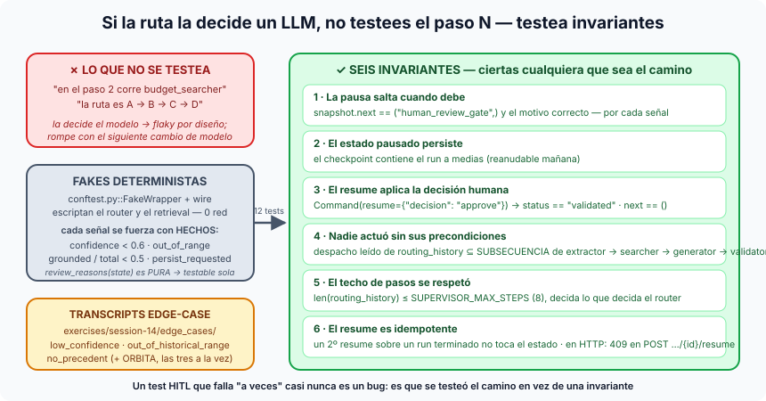

# Píldora — Testear invariantes, no el camino

**Testing por invariantes** es la forma de testear un flujo cuya ruta la
decide un LLM: en vez de afirmar *"en el paso 3 corre `budget_searcher`"*
— que sería flaky por diseño, porque mañana el modelo puede pedir otro
orden — se afirman **propiedades que deben cumplirse pase lo que pase**: la
pausa salta cuando debe, el estado sobrevive, nadie actúa sin sus inputs.

## La idea en una frase

> No afirmes por dónde pasó el flujo; afirma lo que nunca puede dejar de
> ser cierto.

## Por qué el paso N no se testea

En el grafo lineal de la S13 el orden está escrito en código, así que un
test de "primero A, luego B" es un test del código. En el
[supervisor](supervisor-multiagente.md) el orden lo elige el modelo en cada
run: un test que lo fije no testea el sistema, testea el humor del router
de hoy — y romperá con el siguiente cambio de modelo o de prompt. Lo que el
código sí promete son sus **frenos y sus gates**; eso es lo que se prueba.
Es el mismo giro que el *property-based testing*: de "para esta entrada
sale esto" a "para cualquier entrada se cumple esto".

## Las seis invariantes (`test_hitl_edge_cases.py`)

1. **La pausa salta cuando debe.** `test_each_signal_trips_the_pause`:
   `snapshot.next == ("human_review_gate",)` y el motivo correcto en la
   interrupción — para cada una de las tres señales.
2. **El estado pausado persiste.**
   `test_paused_state_is_persisted_in_the_checkpoint`: lo que hay en el
   checkpoint es el run a medias, listo para reanudarse mañana.
3. **El resume aplica la decisión.**
   `test_resume_continues_with_the_human_decision_in_state`: tras
   `Command(resume={"decision": "approve"})`, `status == "validated"` y
   `next == ()`.
4. **Nadie actúa sin precondiciones.**
   `test_no_agent_acted_before_its_preconditions`: el orden de despacho se
   lee de `routing_history` y se comprueba que es una **subsecuencia** de la
   escalera de dependencias `extractor → searcher → generator → validator`.
   Subsecuencia, no igualdad: el modelo puede saltarse pasos o repetir, pero
   nunca adelantar a un agente por delante de sus inputs.
5. **El techo de pasos se respetó.** `test_step_budget_was_never_exceeded`:
   `len(routing_history) ≤ SUPERVISOR_MAX_STEPS`, decida lo que decida el
   router.
6. **El resume es idempotente.**
   `test_second_resume_on_a_finished_run_does_not_corrupt_it`: un segundo
   resume sobre un run terminado no toca el estado; en HTTP el router
   contesta `409`.

Doce tests, parametrizados por las tres señales, y **ninguno afirma un paso
concreto**.

## Fakes deterministas para forzar cada señal

Todo es *network-free*: `conftest.py::FakeWrapper` y el helper `wire`
escriptan el router y el retrieval. La clave es que `review_reasons(state)`
es una **función pura** sobre hechos que escribe `coherence_validator`, así
que cada señal se fuerza controlando los hechos, no rezando por un
transcript:

| Señal | Hecho forzado |
|---|---|
| confianza baja | `confidence < SUPERVISOR_CONFIDENCE_THRESHOLD` (0.6) |
| fuera de rango histórico | `out_of_range` en el resultado del validador |
| sin precedente | `grounded / total < SUPERVISOR_MIN_GROUNDED_RATIO` (0.5) |

(Y desde el directo, un cuarto disparador — `persist_requested` — que es el
de la píldora de [sandboxing](sandboxing-de-agentes.md).)

## Los transcripts edge-case

`exercises/session-14/edge_cases/` guarda un transcript por señal:
`low_confidence.txt`, `out_of_historical_range.txt` (un "login sencillo"
para diez millones de sesiones) y `no_precedent.txt` (relojes ópticos de
estroncio). Contra retrieval y LLM reales disparan la señal de verdad; en
los tests la fuerzan los fakes. El de anclaje de la sesión —
`sample_transcript_edge_case.txt`, el proyecto ORBITA — mezcla componentes
con análogos y sin ellos para provocar las tres a la vez.

## Dónde verlo en nuestro proyecto

- `tests/domain/graph/supervisor/test_hitl_edge_cases.py` (las seis
  invariantes), `conftest.py` (`FakeWrapper`, `wire`),
  `test_failure_modes.py` (síntoma y arreglo de cada fallo del
  pre-ejercicio), `tests/api/test_estimate_supervisor.py` (el `409`).
- `app/domain/graph/supervisor/gate.py` (`review_reasons`,
  `_apply_decision`, `human_review_gate` con `interrupt()` antes de
  cualquier escritura), `state.py` (`routing_history`),
  `app/api/routers/estimate_supervisor.py` (`_thread_config`, `409`).
- `uv run pytest tests/domain/graph/supervisor/test_hitl_edge_cases.py -v`.

## El mapa mental para cerrar

Un test HITL que falla de vez en cuando casi nunca revela un bug: revela que
se testeó el camino en vez de una invariante. Ver también
[human-in-the-loop](human-in-the-loop.md) para el porqué del gate y
[memoria](memoria.md) (nivel 4) para el porqué del checkpoint.
