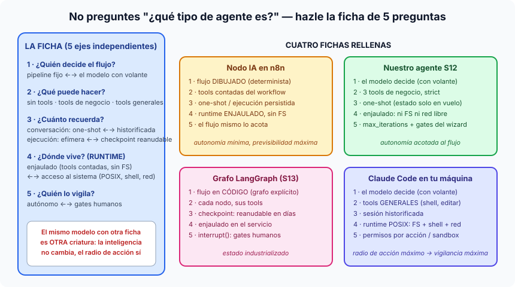

# Píldora — Tipos de agentes: los ejes que la industria mezcla

"¿Qué tipo de agente es?" es casi siempre la pregunta equivocada, porque la
industria intenta hacer UN árbol con lo que en realidad son **ejes
independientes**. Cuando dos personas discuten si algo "es un agente de
verdad", casi siempre están hablando de ejes distintos sin saberlo. La
alternativa: hacerle a cualquier agente la **ficha de 5 preguntas**.

## Las 5 preguntas

1. **¿Quién decide el flujo?** Pipeline determinista (el código dicta los
   pasos) ↔ agente con volante (el modelo decide qué hacer a continuación).
2. **¿Qué puede hacer?** Sin tools (solo genera texto — discutible que sea
   "agente") ↔ tools contadas de negocio ↔ tools de propósito general
   (shell, editar ficheros, navegar).
3. **¿Cuánto recuerda?** Y aquí hay que separar DOS estados que se confunden:
   el **de conversación** (one-shot ↔ historificado ↔ reanudable) y el **de
   ejecución** (¿un run a medias sobrevive a un reinicio? — checkpointing).
   n8n es el ejemplo de por qué separarlos: sus *ejecuciones* persisten y se
   pueden reintentar, aunque su nodo de IA sea conversacionalmente one-shot.
4. **¿Dónde vive y hasta dónde llega? — el RUNTIME.** El término viene de la
   informática clásica: el *runtime environment* es todo lo que rodea a un
   programa mientras corre (la JVM para Java, Node para JS y, debajo de todo,
   el SO y las syscalls que le deja usar). Trasladado a agentes: **el runtime
   es el mundo que el harness le da al modelo** — qué tools existen, si toca
   sistema de ficheros y shell (acceso "POSIX"), si tiene red, si corre en
   sandbox. La tesis fuerte: **el mismo modelo en dos runtimes es dos
   criaturas distintas**. gpt-4o dentro de un nodo de n8n (enjaulado: tres
   tools de negocio, cero ficheros) y el mismo gpt-4o dentro de Claude Code
   en tu portátil (POSIX completo) no se diferencian en inteligencia — se
   diferencian en **radio de acción**. Este eje es además el de la seguridad:
   el runtime define el daño máximo posible, y por eso a más runtime, más
   vigilancia (pregunta 5).
5. **¿Quién lo vigila?** Autónomo ↔ gates humanos (ver la píldora
   [human-in-the-loop](human-in-the-loop.md)) ↔ permisos por acción (el
   modelo de Claude Code: cada comando peligroso pide confirmación).

## El patrón con nombre propio: ReAct

El bucle razonar→actuar→observar tiene partida de nacimiento académica:
**ReAct** (*Reasoning + Acting*, Yao et al., 2022). El paper demostró que
intercalar **razonamiento explícito** (Thought) con **acciones** (Act) y sus
**observaciones** (Obs) rinde más que razonar todo primero y actuar después —
porque cada observación corrige el plan. Todo agente moderno de function
calling es ReAct industrializado: el "Thought" es hoy el razonamiento interno
del modelo (los resúmenes que vemos en la traza), el "Act" es la tool call, y
la "Obs" es el resultado que devolvemos. Nuestro agente S12 **es** un agente
ReAct — simplemente ya nadie lo llama así en el código, igual que nadie dice
"aplicación cliente-servidor" al hablar de una web.

## Ejemplos con la ficha rellena

| | Flujo | Tools | Memoria | Runtime | Vigilancia |
|---|---|---|---|---|---|
| **Nodo IA en n8n** | dibujado (determinista) | contadas | one-shot / runs persistidos | enjaulado | el flujo acota |
| **Nuestro agente S12** | modelo | 3 de negocio | one-shot (estado en vuelo) | enjaulado | max_iterations + gates wizard |
| **Grafo LangGraph S13** | código (grafo) | por nodo | checkpoint reanudable | enjaulado | interrupt() |
| **ChatGPT / Claude app** | modelo | generales (web, código) | sesión historificada | sandbox del proveedor | políticas |
| **Claude Code local** | modelo | generales | sesión | **POSIX: FS+shell+red** | permisos por acción |

La lectura de la tabla es la lección: n8n y Claude Code no son "el agente malo
y el bueno" — son **configuraciones opuestas de la misma ficha**, cada una
correcta para su trabajo. Acotar (n8n, nuestro S12) compra previsibilidad;
abrir el runtime (Claude Code) compra capacidad — y se paga en vigilancia.
