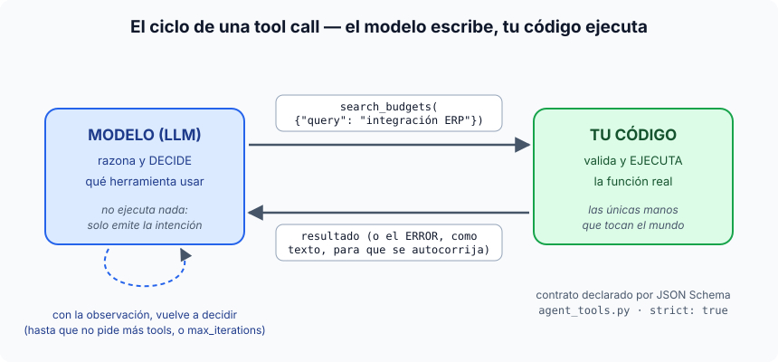
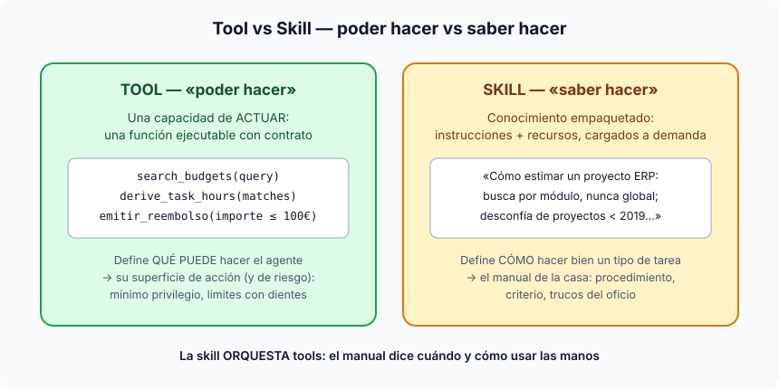
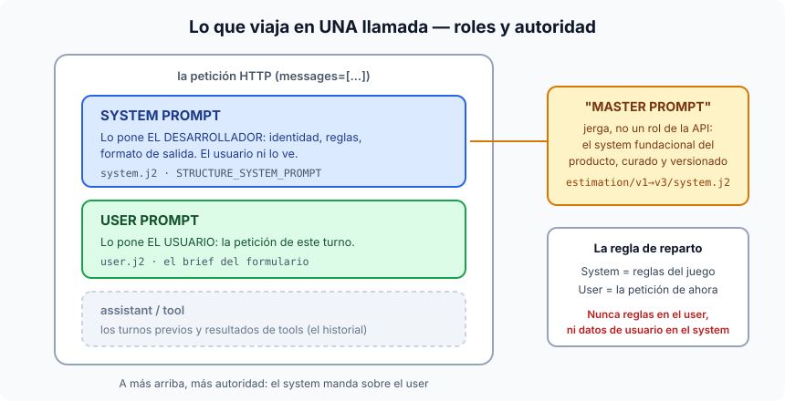
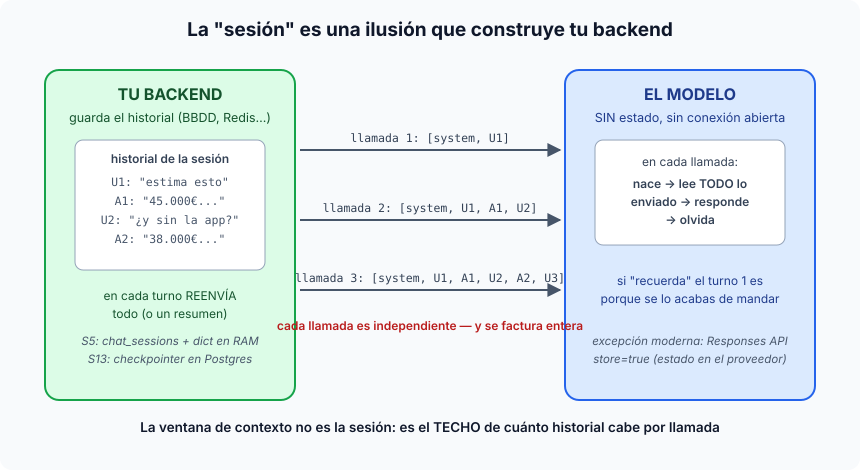

# Sesión 12 — Introducción a agentes de IA · Guion

## 1. ¿Qué es un agente de IA?

### La definición en una frase

Un agente es un LLM metido en un bucle, con **herramientas** que puede invocar
y un **objetivo** — donde es el propio modelo, y no tu código, quien decide en
cada paso qué hacer a continuación. 

**Es decir, esto ya no es determinista, es agéntico.**

La frase que separa las aguas y sobre la que pivota toda la sesión:

> **En un pipeline, el control de flujo vive en el código.
> En un agente, el control de flujo vive en el modelo.**

Todo lo que hemos construido hasta hoy (S4–S11) es lo primero. Hoy cruzamos.

### El bucle (razonar → actuar → observar)

1. **Razonar**: el modelo mira el objetivo y lo que sabe hasta ahora, y decide
   la siguiente acción.
2. **Actuar**: emite una llamada a una herramienta con sus argumentos
   (`search_budgets({"query": "integración SAP"})`).
3. **Observar**: tu código ejecuta la herramienta y le devuelve el resultado.
   Con esa observación, vuelta al paso 1.

El bucle termina cuando el modelo decide que ya tiene lo que necesita (un
turno sin llamada a herramienta) — con una red de seguridad de código:
`max_iterations`, porque a un modelo no se le deja decidir *indefinidamente*.

### Aplicado a NUESTRO proyecto

Llevamos tres sesiones estimando desde una transcripción con un **pipeline
fijo** (S9–S11): `reformular → recuperar → generar`. Siempre los mismos pasos,
en el mismo orden, decididos por código. Funciona muy bien... mientras la
transcripción sea *un* proyecto.

¿Y si la reunión mezcla tres encargos que no tienen nada que ver — un backend
de negocio, una integración con ERP y una app móvil? Una única búsqueda en los
presupuestos históricos mezcla los tres temas y recupera ruido. Lo que
querrías es: busca precedentes del backend, *luego* busca los del ERP, *luego*
los de la app, y ajusta cada búsqueda según lo que encontró la anterior.
¿Cuántas búsquedas? ¿En qué orden? **Depende de la transcripción** — y eso es
exactamente lo que un pipeline no puede decidir y un agente sí.

Nuestro agente (`app/generation/agentic/`):

- **El bucle**: `agent_loop.py::run_estimation_agent` — escrito A MANO sobre
  la Responses API de OpenAI, sin framework. Es deliberado: el objetivo de la
  sesión es *ver* el bucle, no esconderlo tras una librería.
- **Las tres herramientas** (`agent_tools.py`):
  - `search_budgets` — busca en los presupuestos históricos (envuelve el
    `retrieve()` real de la S10).
  - `derive_task_hours` — deriva las horas por consenso de los vecinos.
  - `validate_estimate` — comprueba la coherencia del resultado.
- **Detalles del oficio** que se ven en el código: los errores de una
  herramienta se le devuelven al modelo como texto (para que se autocorrija en
  el siguiente turno, en vez de tumbar el bucle), el estado se encadena con
  `previous_response_id` (el servidor recuerda el razonamiento), y
  `max_iterations=10` acota el peor caso.
- **Ejecutarlo**: `scripts/run_agent_s12.py` — imprime la traza `STEP N`
  (razonamiento → tool → resultado), que es la radiografía del bucle. La traza
  de ejemplo committeada: `exercises/session-12/example_trace_complex.txt`.

Señalar en la traza: el agente hace *distinto número de búsquedas según la
transcripción*. Con la simple, 1–2; con la compleja, una por componente. Nadie
programó eso — es la decisión del modelo. Eso ES ser un agente.

### Dos ejemplos de fuera, para ver que el patrón es el mismo

**1. Un agente de programación (Claude Code, Cursor...).** Objetivo: "arregla
este test que falla". Herramientas: leer fichero, editar fichero, ejecutar
tests, buscar en el código. El bucle en acción: ejecuta los tests → observa el
error → abre el fichero implicado → edita → re-ejecuta → sigue fallando →
lee otro fichero → edita → re-ejecuta → verde → para. Nadie escribió ese
orden: con otro bug, la secuencia habría sido otra. Fijaos en que es
literalmente nuestro bucle con otras herramientas — y en el mismo detalle de
oficio que nuestro `agent_loop.py`: el error del test se le devuelve al modelo
como observación, y de ahí sale la corrección.

**2. Un agente de soporte al cliente.** Objetivo: "resuelve este ticket".
Herramientas: consultar pedido, consultar política de devoluciones, emitir
reembolso, escalar a un humano. Llega "mi pedido no llegó y quiero mi dinero":
el agente consulta el pedido (¿consta entregado?), según eso consulta la
política (¿dentro de plazo?), y decide entre reembolsar o escalar. Otro ticket
distinto activa otras herramientas en otro orden. Aquí se ve además la cara de
**seguridad**: a este agente le das `emitir_reembolso` con un límite de
importe, y `escalar_a_humano` existe precisamente porque el agente debe saber
cuándo NO decidir él — la versión con dientes de nuestro `max_iterations`.

### Y la contra-lección (para cerrar la sección)

Un agente no es "mejor" que un pipeline: es **más caro, más lento y menos
predecible** (cada decisión es una llamada al LLM, y dos ejecuciones pueden no
hacer lo mismo). La regla del oficio:

> Si conoces el flujo de antemano → pipeline (determinista, barato, depurable).
> Si el flujo depende de la entrada → agente.

Por eso el proyecto CONSERVA el pipeline S9–S11 como camino por defecto y el
agente es un camino adicional para el caso que lo justifica. Esta tensión
reaparece en la S13 (grafos: flujo fijo otra vez, pero explícito) y estalla en
la S14 (¿cuánto control le cedes al modelo? — supervisor).

---

## 2. ¿Qué son las tools?

### La idea en una frase

Una tool es una **función tuya que le prestas al modelo**: tú la declaras
(nombre, para qué sirve, qué argumentos acepta), el modelo decide cuándo
llamarla y con qué argumentos — pero **quien la ejecuta siempre es tu código**.



### El malentendido a matar primero

"El modelo ejecuta funciones" — NO. El modelo es un generador de texto: lo
único que hace es emitir un JSON con la *intención* (`search_budgets` con
`{"query": "integración ERP"}`). Tu código lee esa intención, decide si la
honra, ejecuta la función de verdad y le devuelve el resultado como texto.
El LLM nunca toca el mundo; **tus manos son las únicas manos**. Esta
distinción es la base de toda la seguridad de agentes.

### El contrato: JSON Schema

Cada tool se declara con un esquema — qué campos, de qué tipo, cuáles
obligatorios. En nuestro código (`agent_tools.py`) los tres esquemas van con
`strict: true`: el proveedor **garantiza** que los argumentos que emite el
modelo cumplen el esquema (generación restringida, la misma maquinaria que
Instructor usa para los outputs estructurados de la S4 — mismo truco, otra
puerta). Y son deliberadamente **planos**: cuanto más simple el esquema, menos
se equivoca el modelo al rellenarlo.

### Qué mirar en nuestro código

- `agent_tools.py` — los tres esquemas + sus implementaciones + `dispatch_tool`
  (el "router" que mapea nombre → función).
- El detalle de oficio: si la tool falla, el error **se devuelve al modelo
  como texto** en vez de romper el bucle — y el modelo se autocorrige en el
  siguiente turno (reintenta con otros argumentos). Un error también es una
  observación.
- La cara de seguridad: la lista de tools ES la superficie de acción del
  agente — lo que no está declarado, no puede hacerlo. De ahí sale el "mínimo
  privilegio" de la S14 (`supervisor/privilege.py`): a cada agente, solo sus
  tools.

### Diseño de tools de calidad (adelanto del bloque de patrones)

Pocas y ortogonales (3 bien definidas > 10 solapadas), nombres que digan lo
que hacen, descripciones escritas PARA el modelo (son prompt), argumentos
tipados y estrechos, y errores descriptivos (el modelo corrige mejor con
"threshold must be between 0 and 1" que con "error 500").

---

## 3. ¿Qué son las skills?

### La idea en una frase

Si la tool es **poder hacer** (una capacidad ejecutable), la skill es **saber
hacer**: conocimiento procedimental empaquetado — instrucciones, criterio,
trucos del oficio, a veces con recursos o scripts de apoyo — que el agente
carga cuando la tarea lo pide.



### La distinción con un ejemplo del proyecto

- Tool: `search_budgets(query)` — la *capacidad* de buscar precedentes.
- Skill: "Cómo estimar un proyecto con ERP: busca por módulo y nunca en
  global; desconfía de precedentes anteriores a 2019; si el cliente menciona
  SAP, añade siempre una partida de middleware" — el *manual de la casa* que
  dice cuándo y cómo usar esa capacidad.

La skill **orquesta** tools: no añade capacidades nuevas, añade criterio sobre
las que ya hay.

### Dónde lo tienen delante los alumnos

Claude Code (o Cursor) es el ejemplo vivo: sus *skills* son carpetas con un
`SKILL.md` de instrucciones (+ scripts opcionales) que el agente carga **bajo
demanda** — en contexto solo viaja el nombre y una línea de descripción, y el
contenido completo entra únicamente cuando la tarea encaja. Ese "cargar solo
cuando toca" (*progressive disclosure*) es la gracia: el saber-hacer de la
casa no quema tokens de contexto hasta que hace falta.

### Honestidad sobre nuestro proyecto

Nuestro agente S12 **no tiene un sistema de skills** — es un concepto más
reciente que el temario original. Lo más parecido que ya existe: los prompts
versionados de la S4 (conocimiento de cómo estimar, empaquetado fuera del
código) y el parámetro `persona` del `agent_loop.py`, que inyecta
"instrucciones del operador" extra al system prompt. La diferencia con una
skill de verdad: aquí lo decide el código al arrancar; en un sistema de
skills, el agente elige qué manual abrir según la tarea.

### El mapa mental para cerrar

> **Tool = mano. Skill = manual. Agente = quien decide qué manual abrir y qué
> mano usar.**

---

## 4. Prompt engineering: master, system y user prompt

### Los tres niveles

Una llamada a un LLM no lleva "un prompt": lleva una **conversación con
roles**, y cada rol tiene un peso distinto. De más autoridad a menos:



**System prompt** — las instrucciones del *desarrollador*: quién es el modelo,
qué reglas sigue, en qué formato responde. El usuario final ni lo ve ni
debería poder pisarlo (por eso los ataques de *prompt injection* van justo a
intentar colarse aquí). En nuestro proyecto: los `system.j2` de
`app/foundation/prompts/` y las constantes `*_SYSTEM_PROMPT` del agente.

**User prompt** — el turno del *usuario*: la petición concreta de esta vez.
En nuestro proyecto: los `user.j2`, rellenados con el brief del formulario.

**Master prompt** — ojo: NO es un rol de la API (la API solo conoce system /
user / assistant + tool). Es jerga de la industria para el **system prompt
fundacional de un producto**: ese documento grande y curado — identidad,
reglas de negocio, tono, límites — del que a veces se ensamblan variantes. Los
"system prompts filtrados" de ChatGPT o Claude que circulan por internet son
exactamente eso: el master prompt del producto. En nuestro proyecto, el
equivalente es el `system.j2` versionado (v1→v3): el conocimiento de "cómo se
estima en esta casa", mantenido como un artefacto con versiones — el master
prompt del estimador.

### La regla de reparto (para la pizarra)

> **System = quién eres y las reglas del juego (lo pone el desarrollador).
> User = qué te pido ahora (lo pone el usuario).
> Lo que nunca: reglas en el user prompt, ni datos del usuario en el system.**

Esa última línea es la que separa el prompting amateur del profesional: si las
reglas viajan en el turno de usuario, cualquier usuario puede renegociarlas.

### En el agente de hoy

El bucle S12 tiene su system prompt (`STRUCTURE_SYSTEM_PROMPT`) y además
admite un extra de operador (el parámetro `persona`, que se CONCATENA al
system, nunca al user — coherente con la regla de arriba). Y un matiz nuevo de
esta sesión: **las descripciones de las tools también son prompt** — el modelo
decide qué herramienta usar leyéndolas, así que se redactan con el mismo
cuidado que el system.

---

## 5. El concepto de "sesión" en IA

### La intuición... y la trampa

La intuición natural: "una sesión es una conexión con el servidor del modelo
que va guardando mi conversación". Cuidado: **el modelo no guarda nada y no
hay conexión persistente**. Cada llamada a la API es una petición HTTP
independiente y sin estado — el modelo nace, lee TODO lo que le mandas,
responde y muere. Si en el turno 10 "se acuerda" del turno 1 es porque
*alguien le reenvió los 9 turnos anteriores* dentro de la petición.

La definición honesta:

> **Una sesión es una ilusión que construye tu backend: el historial
> acumulado de una conversación, guardado por ti y reenviado (entero o
> resumido) en cada turno.** La ventana de contexto no es la sesión — es el
> LÍMITE físico de cuánto historial cabe por llamada.



### Las tres formas de construir esa ilusión (las tres están en el proyecto)

1. **Historial en tu backend (el modo clásico).** Guardas los mensajes y los
   reenvías todos en cada llamada. Es nuestra S5: `chat_sessions` en Rails +
   las sesiones del servicio IA — que viven en un dict en RAM (¡su propio
   docstring avisa de que eso no sobrevive a un reinicio!).
2. **Estado en el proveedor (lo nuevo).** La Responses API de OpenAI permite
   `store=true` + `previous_response_id`: el servidor SÍ retiene la
   conversación y tú solo mandas el delta. Es exactamente lo que hace nuestro
   bucle S12 — y por eso encadena turnos sin reenviar el historial (incluido
   el razonamiento interno, que nunca viaja de vuelta). Aquí la intuición de
   la "conexión historificada" se vuelve casi verdad... pero es una excepción
   reciente, no la regla.
3. **Estado propio con identificador (la versión producción).** Un
   `thread_id` + persistencia tuya: el checkpointer de LangGraph (S13) guarda
   el estado del grafo en Postgres por hilo, y la "sesión" sobrevive a
   reinicios y a pausas de días esperando a un humano.

### Las consecuencias que importan (y que se pagan)

- **El coste crece con la sesión**: en el modo clásico, cada turno re-envía y
  re-factura todo el historial. De ahí el prompt caching de los proveedores y
  nuestra obsesión con las cachés.
- **La ventana de contexto es un techo, no una promesa**: cuando el historial
  no cabe, alguien decide qué se tira o se resume — nuestra S5 tiene un módulo
  entero de compresión de conversación por eso.
- **"El modelo me recuerda" es siempre ingeniería**: memoria entre sesiones
  (el "recuérdame para la próxima vez") es OTRA capa más — recuperar datos del
  usuario e inyectarlos al contexto — que alguien construyó. Nada de esto
  viene de fábrica.

---

## 6. La traza del agente: qué es y qué te cuenta

### La idea en una frase

La traza es el **registro paso a paso del bucle**: por cada STEP, qué razonó
el modelo, qué acción emitió (tool + argumentos) y qué observó de vuelta. Es
el razonar→actuar→observar hecho legible — a un agente lo que los logs a un
servicio, pero contando **decisiones**, no eventos.

### Un ejemplo simple (el brief del gimnasio del notebook `agente-minimo.ipynb`)

```
STEP 1
  reasoning:   El proyecto tiene tres piezas; empiezo por el registro de socios.
  action:      search_tasks({"query": "user registration email verification"})
  observation: [{"task": "user registration with email verification", "hours": 16}]

STEP 2
  reasoning:   Ahora los pagos de cuotas; busco un análogo de Stripe.
  action:      search_tasks({"query": "stripe payment integration"})
  observation: [{"task": "Stripe payment integration", "hours": 40}]

STEP 3
  reasoning:   Falta el dashboard de administración con gráficas.
  action:      search_tasks({"query": "admin dashboard usage charts"})
  observation: [{"task": "admin dashboard with usage charts", "hours": 60}]

(turno sin tool calls → parada natural → respuesta final: tabla con 116 h)
```

Qué señalar en ella, línea a línea:
- **Tres búsquedas porque el brief tenía tres piezas** — nadie programó ese
  número; con otro brief serían dos o cinco. La traza es donde se VE la
  decisión adaptativa.
- La **parada**: terminó porque el modelo dejó de pedir tools (natural), no
  porque lo cortara `max_iterations`. Si viera `stopped_reason:
  max_iterations`, sabría que algo no convergía.
- Si una tool fallara, el error aparecería como `observation` — y en el STEP
  siguiente verías al modelo **corregirse** (reintentar con otros argumentos).
  Los errores también dejan huella.

### Qué información te da (los cuatro usos)

1. **Depurar**: ¿por qué buscó "gym membership" en vez de "user registration"?
   La traza te enseña la query exacta que emitió — y suele apuntar a una
   description de tool mejorable, no al modelo.
2. **Auditar**: es la PRUEBA de que el agente decidió dentro de sus límites —
   qué tocó, qué no, cuántas veces. Sin traza, "confía en que se portó bien"
   es un acto de fe. (Este es el argumento central del bloque 2.2 de la guía
   oficial: la traza no es un log, es la evidencia de la autonomía acotada.)
3. **Atribuir coste**: cada STEP es un round-trip al LLM. Una traza de 12
   pasos donde esperabas 4 es una factura y una latencia que explicar.
4. **Explicar al usuario**: en nuestro wizard la traza se renderiza bajo los
   pasos de estructura y horas — el cliente ve *de dónde* salió cada número.

### Dónde vive en el proyecto

El contrato tipado: `AgentStep`/`AgentTrace` con su `render()` al formato
`STEP N` (`app/domain/schemas/agent_trace.py`); viaja opcional dentro de las
respuestas (`agent_trace` en `GenerateResult`/`TaskHoursResult`) y Rails la
pinta con el partial `_agent_trace.html.erb`. La de ejemplo committeada:
`ai-service/exercises/session-12/example_trace_complex.txt`. Y la puedes
generar en vivo con el notebook `agente-minimo.ipynb`, que imprime una por
ejecución.

---

## 7. [PENDIENTE] Tipos de agentes: los ejes que la industria mezcla

## 8. [PENDIENTE] La Responses API y el bucle a mano

## 9. [PENDIENTE] Demo en vivo con la transcripción compleja

## 10. [PENDIENTE] Ejercicio de los alumnos


-- ver ejercicio mandado
-- ver codigo agent loop
-- ver interfaz app lidr config de agentes
-- explicar que es importante la decicion de donde y de que forma crear y meter los agentes en los procesos
-- probar ejeccion en rag rwizard de sample_transcript_complex
-- min 20 : 
- usar diapo explicar one shot vs acotado
- explicar codigo estimate_agent.py los diferentes endpoints para diviidr el prcoeso en varias calls a a la api
      - estructure
      - hours