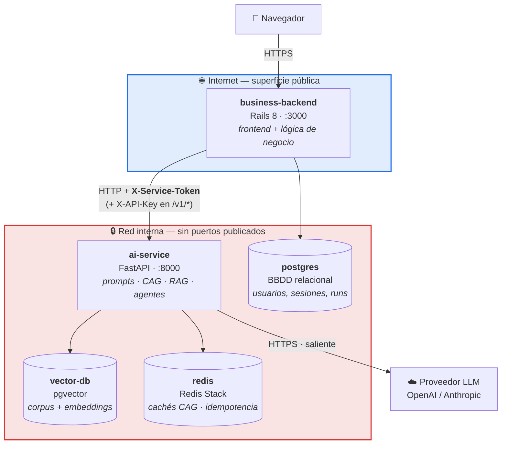
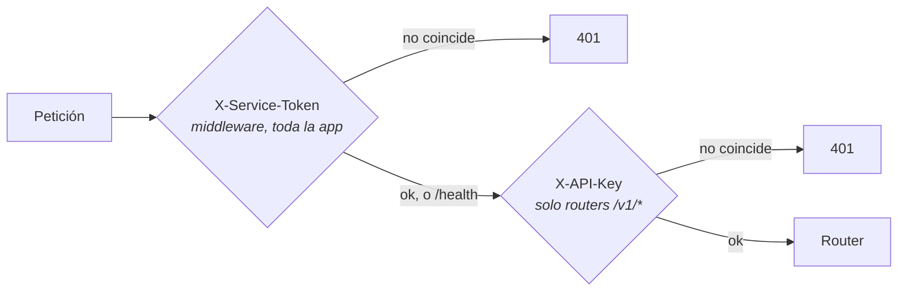
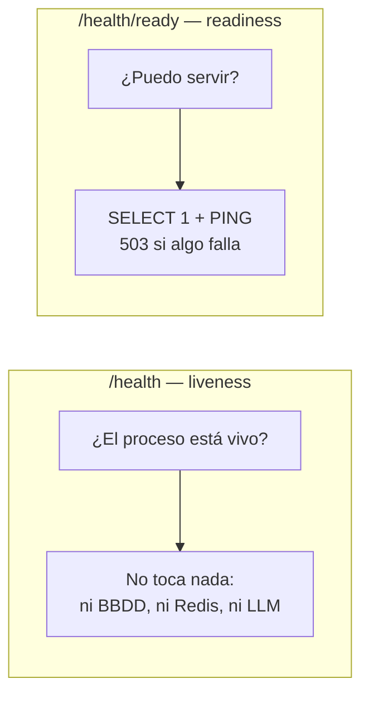

# Arquitectura del sistema

Sesión 15 · Módulo 6 — Arquitectura de producción y despliegue

Tres capas y dos almacenes. El diagrama está **como código** (Mermaid) para que
se versione con el repo y no se quede obsoleto en una diapositiva.

---

## Nomenclatura

El programa evita "backend" a secas porque hay dos. En todo el repo:

| Capa | Carpeta | Servicio | Stack | ¿Público? |
|---|---|---|---|---|
| Frontend | `business-backend/app/views` | — | Hotwire + Tailwind | sí (dentro de Rails) |
| Backend de negocio | `business-backend/` | `business-backend` | Rails 8 | **sí — el único** |
| Servicio IA | `ai-service/` | `ai-service` | Python + FastAPI | **no** |
| BBDD relacional | — | `postgres` | Postgres 16 | no |
| BBDD vectorial | — | `vector-db` | pgvector (Postgres 16) | no |
| Cachés / idempotencia | — | `redis` | Redis Stack | no |

En la referencia, frontend y backend de negocio son **un solo proyecto Rails**.
Son dos capas conceptuales, un despliegue.

---

## La frontera público/privado

**La regla, en una frase:** solo el backend de negocio publica un puerto. El
servicio IA y los tres almacenes **no son alcanzables desde fuera** — ni siquiera
desde la máquina anfitriona.

Cómo se materializa esa regla en cada entorno:

| | Local (compose) | Cloud (EC2 + Caddy) |
|---|---|---|
| Público | `business-backend`, `ports: ["3000:3000"]` | **`caddy`**, `ports: 80/443` — y nada más |
| Backend de negocio | el punto de entrada | **interno**: pierde su `ports:`, solo lo alcanza el proxy |
| Servicio IA | **sin `ports:`** | **sin `ports:`** (igual) |
| BBDD | sin `ports:` | sin `ports:` (igual) |
| Resolución | DNS por nombre de servicio | DNS por nombre de servicio (igual) |
| Quién impone la frontera | el fichero compose | **tres capas**: security group + `ufw` + compose |
| TLS | no hay | Caddy, con certificado automático |

En una VM **nada expresa la frontera por ti**: en un PaaS marcas un servicio como
privado y deja de tener URL; aquí la construyes con el *security group*, con lo
que publica compose y con el proxy. Por eso son tres capas y no una — cada una
asume que las otras pueden estar mal configuradas.

El navegador **nunca** habla con el servicio IA, y el servicio IA **nunca** habla
con el navegador. Las claves del proveedor LLM viven solo en la capa privada.

---

## Por qué el navegador no llama al servicio IA

No es una decisión estética. Si el navegador llamara directamente:

1. La clave del proveedor tendría que viajar al cliente, o habría que construir
   un proxy — que es exactamente el backend de negocio.
2. No habría dónde aplicar reglas de negocio (cuotas, permisos, facturación).
3. Los guardarraíles serían opcionales: bastaría con no llamar al endpoint que
   los aplica.

---

## El contrato entre capas

El servicio IA publica un contrato **versionado** (`/v1/…`) con payloads Pydantic.
FastAPI genera el OpenAPI a partir de esos mismos modelos, así que la
documentación no puede desincronizarse del código: `/docs`, `/redoc`,
`/openapi.json`.

### Superficie que consume el backend de negocio

30 rutas, listadas en `docs/contract/business-backend-consumed-routes.json` y
verificadas en CI por `ai-service/scripts/check_contract.py`. Las principales:

| Método | Ruta | Qué hace | Auth |
|---|---|---|---|
| `POST` | `/api/v1/estimate` | Estimación CAG (S04) | token |
| `POST` | `/v1/estimate/from-transcript` | Estimación RAG fundamentada (S09) | token + `X-API-Key` |
| `POST` | `/v1/estimate/graph` | Flujo LangGraph multi-agente (S13) | token + `X-API-Key` |
| `POST` | `/v1/estimate/supervisor` | Flujo supervisor (S14) | token + `X-API-Key` |
| `POST` | `/v1/retrieval/search` | Recuperación k-NN | token + `X-API-Key` |
| `GET` | `/health` | **Liveness** — sin auth, sin dependencias | ninguna |
| `GET` | `/health/ready` | **Readiness** — comprueba BBDD y Redis | ninguna |

### Las dos capas de autenticación

No son redundantes; responden preguntas distintas.

| Capa | Cabecera | Alcance | Pregunta |
|---|---|---|---|
| Token de servicio (S15) | `X-Service-Token` | Middleware; toda la app salvo probes y docs | ¿Eres un servicio autorizado a hablarme? |
| Claves por router (S09) | `X-API-Key` | `/v1/retrieval/*` y `/v1/estimate/*` | ¿Qué endpoints concretos puedes usar? |

Un token válido **no** abre los routers con clave. Lo fija
`tests/api/test_service_token.py::test_the_two_auth_layers_are_independent`.

> **Ojo con el default:** si `AI_SERVICE_TOKEN` está vacío, el middleware se
> **desactiva**. Es deliberado (permite `uv run uvicorn` y los tests sin fricción)
> y es lo contrario de las claves de la S9, donde una clave vacía devuelve 401 en
> todo. En cualquier despliegue real, ponle valor.

---

## Los errores son parte del contrato

El backend de negocio ramifica sobre el código de estado, así que cambiar uno es
un cambio de contrato. `EstimatorAi::BaseClient#handle_response` los traduce a
una taxonomía tipada.

| Código | Significa | Clase en Rails | ¿Reintentar? |
|---|---|---|---|
| `400` | Guardarraíl de entrada (moderación / inyección / PII) | `GuardrailViolation` | no — cambia la entrada |
| `401` | Token de servicio o API key inválidos | `Unauthorized` | no — configuración |
| `404` | Sesión o ejecución inexistente | `SessionNotFound` | no |
| `409` | Nada pendiente que reanudar / duplicado | `Conflict` | no |
| `415`, `422` | Entrada inválida (Pydantic) | `InvalidRequest` | no |
| `429` | Límite de peticiones por API key | `RateLimited` | **sí**, tras `Retry-After` |
| `500` | Fallo genuino del servicio IA | `ServerError` | no |
| `502` | El LLM upstream falló | `ServerError` | quizá |
| `503` | **Una dependencia no está disponible** (BBDD vectorial, Redis, embedder) | `ServiceUnavailable` | **sí** |

La distinción que más importa es **502 vs 503**: "el upstream contestó mal" frente
a "no puedo ni intentarlo". Solo la segunda invita a reintentar, y por eso el
cliente las separa en clases distintas.

---

## Liveness vs readiness

`/health` lo llaman el `HEALTHCHECK` de Docker y el `depends_on: service_healthy`
de compose **cada 30 segundos**. Si llamara al modelo, estarías pagando 2.880
llamadas al día por comprobar que el contenedor sigue en pie. Por eso no toca
nada y por eso está exento del token: un healthcheck no puede llevar credenciales.

`/health/ready` sí comprueba las dependencias duras y devuelve 503 nombrando la
que falla — pero **tampoco llama al LLM**: una llamada al modelo cuesta dinero y
segundos, y convertiría un proveedor con rate limit en una caída autoinfligida.

---

## Documentos relacionados

- `docs/deployment-local.md` — arranque local y las 5 comprobaciones
- `docs/deploy-ec2.md` — despliegue en cloud
- `docs/scalability.md` — límites de concurrencia y qué se rompe primero
- `docs/ci-cd.md` — el pipeline
- `docs/decisions.md` — decisiones y suposiciones
- `ai-service/ARCHITECTURE.md` — capas internas del servicio IA
- `business-backend/ARCHITECTURE.md` — capas internas del backend de negocio
