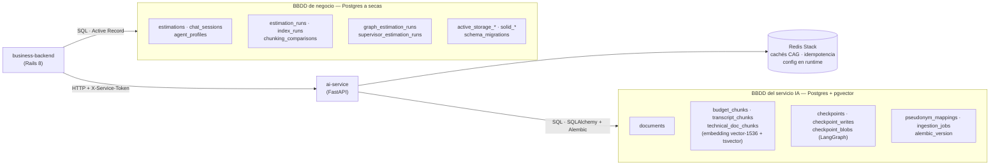

# Infraestructura de bases de datos

El proyecto tiene **dos bases de datos Postgres separadas más un Redis**, y la
separación es deliberada: cada servicio es dueño exclusivo de la suya
(*database per service*). Ninguno lee los datos del otro — cuando el backend de
negocio necesita algo del servicio IA, se lo pide **por HTTP**, nunca por SQL.
No hay ni una sola foreign key que cruce de una base a la otra.

## BBDD de negocio (la de Rails)

Postgres estándar. En el curso es el contenedor `postgres`; en el despliegue
cloud, la database `estimator_web_production` de Neon. Guarda el **negocio**:

| Tablas | Qué son |
|---|---|
| `estimations`, `chat_sessions`, `agent_profiles` | Estimaciones clásicas (S4), chat (S5), perfiles de agente |
| `estimation_runs`, `index_runs`, `chunking_comparisons` | Los runs de los wizards RAG (S7–S10); la respuesta JSON completa se persiste como JSONB |
| `graph_estimation_runs`, `supervisor_estimation_runs` | Los runs de los flujos con pausa humana (S13–S14) |
| `active_storage_*`, `solid_*`, `schema_migrations` | Adjuntos, infra de Rails 8, control de migraciones |

Migra con **Active Record** (`db/migrate/` + `bin/rails db:prepare` en el
entrypoint).

## BBDD del servicio IA (la vectorial)

El mismo motor Postgres **con la extensión pgvector** — la base vectorial y la
relacional del servicio IA son una sola: los embeddings viven en columnas
`vector(1536)` junto a datos normales. En el curso es el contenedor
`vector-db` (volumen `estimator_postgres_data`); en cloud, la database
`neondb` de Neon.

| Tablas | Qué son |
|---|---|
| `documents` | Cabecera de cada documento ingestado (el corpus) |
| `budget_chunks`, `transcript_chunks`, `technical_doc_chunks` | Los trozos de cada colección: texto + embedding + `tsvector` (búsqueda híbrida) + metadatos JSONB. Índices HNSW sobre `halfvec` |
| `checkpoints`, `checkpoint_writes`, `checkpoint_blobs` | El estado de los grafos LangGraph (S13/S14) — es lo que permite que un flujo pause días esperando revisión humana y se reanude |
| `pseudonym_mappings`, `ingestion_jobs` | Guardrails PII (S6) y jobs de ingesta |
| `alembic_version` | Control de migraciones (ver `ai-service/alembic/README.md`) |

Migra con **Alembic** (`alembic upgrade head` en el entrypoint).

## Redis (el tercero en discordia)

No es relacional: almacén clave-valor con el módulo RediSearch (por eso es
Redis **Stack**, no el redis normal). Solo lo toca el servicio IA: caché
exacta y caché semántica de estimaciones (CAG), store de idempotencia y
overrides de modelos en runtime (pestaña Ajustes). Es el único datastore que
sigue siendo contenedor en el despliegue cloud.

## La regla que lo sostiene todo

Quién accede a qué, sin excepciones:

- `business-backend` → su Postgres (SQL) y el servicio IA (HTTP). **Jamás** a
  la base vectorial ni a Redis.
- `ai-service` → su Postgres/pgvector (SQL) y Redis. **Jamás** a la base de
  Rails.
- El navegador → solo a `business-backend`. Las bases de datos no publican
  puertos.

Consecuencia práctica: cada base evoluciona con las migraciones de su dueño,
se puede volcar/restaurar por separado (el corpus viaja con
`scripts/dump_corpus.sh` sin tocar la de Rails) e incluso vivir en proveedores
distintos sin que el otro servicio se entere.
